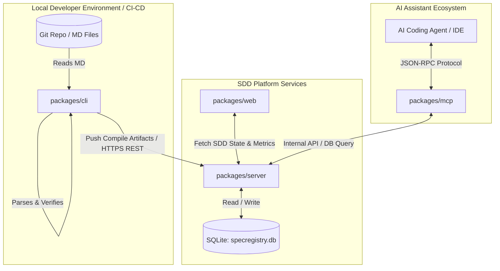
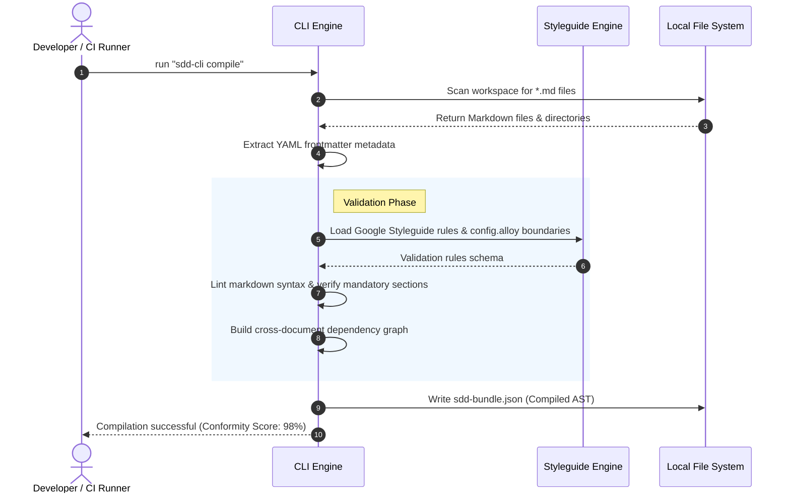
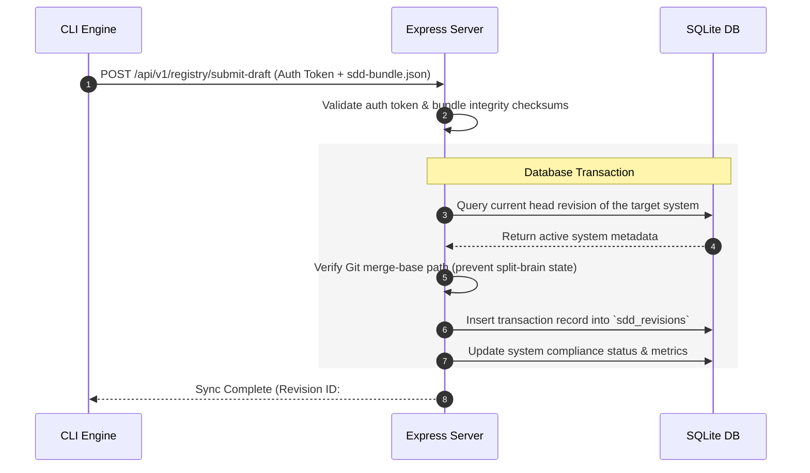
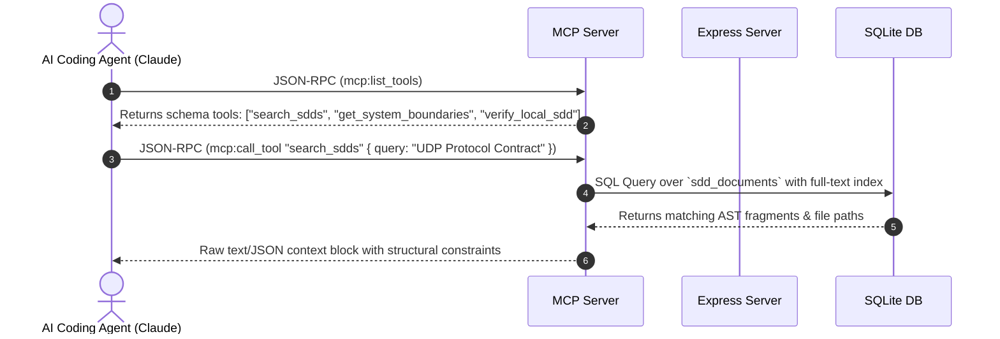
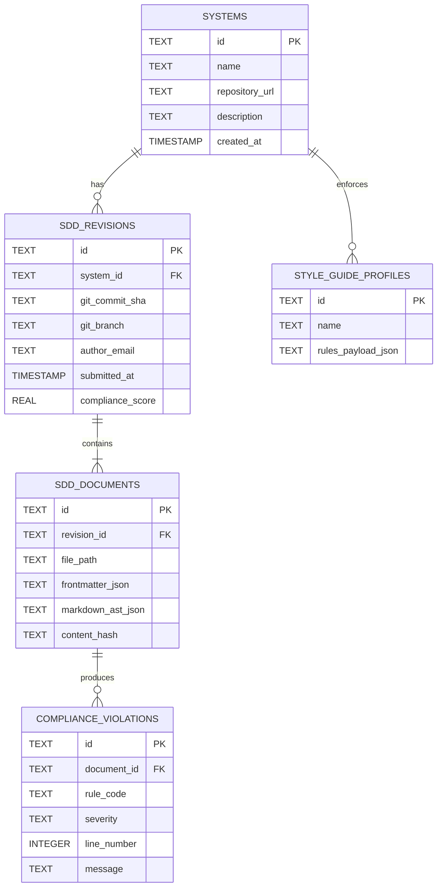
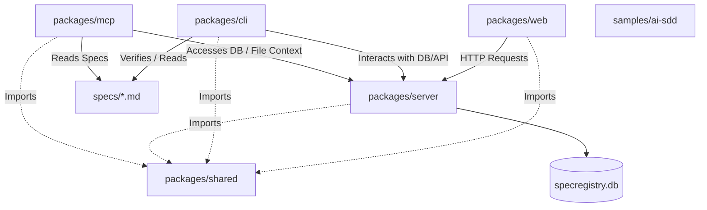

<!-- generated by SpecRegistry — do not edit by hand; run `specreg sync` to refresh. -->

# Web App Standard — Governed Specifications

This file is compiled from the organization's governed specification registry for the project type **Web App Standard**. Treat every section as authoritative guidance. If you find a contradiction or ambiguity while working, report it through the SpecRegistry feedback channel (MCP tool `report_spec_feedback` or POST /api/v1/ai/feedback) instead of guessing.

_Compiled 2026-07-30T18:23:56.538Z · AGENT_OPERATING_RULES.md@1.0.0 · AI_AGENT_OPERATING_RULES.md@1.0.0 · CODE_DEVELOPMENT_STANDARDS.md@1.0.0 · CODING_STANDARDS.md@1.0.0 · DOCUMENTATION_STANDARDS.md@1.0.0 · GIT_FLOW.md@1.0.0 · GLOBAL_SECURITY.md@1.0.0 · IMPLEMENTATION_EVIDENCE.md@1.0.0 · OBSERVABILITY_AND_TRACEABILITY.md@1.0.0 · PROJECT_PROFILE.md@1.0.0 · SDD_OPERATING_MODEL.md@1.0.0 · SECURITY_AND_SECRETS.md@1.0.0 · SPEC_AUTHORING_STANDARD.md@1.0.0 · SPEC_GOVERNANCE.md@1.0.0 · TICKET_WORKFLOW.md@1.0.0 · TOKENOMICS.md@1.0.0 · TRACEABILITY_AND_OBSERVABILITY.md@1.0.0 · DESIGN.md@1.0.0 · STRUCTURE.md@1.0.0_

## SpecRegistry Operating Rules

These rules govern how you use this compiled file with SpecRegistry:

1. Prefer MCP when available. Use the `specregistry` MCP server from `.mcp.json` to call `get_specs`, `search_specs`, `report_spec_feedback`, `get_audit_prompt`, and `report_token_usage` when token counts are available.
2. Load live specs before non-trivial code changes. This compiled file is a bootstrap, but MCP is the live retrieval and feedback channel.
3. Preserve project scope. Ensure MCP is using the configured project type and repo/project identity so global, project-type, and project-scoped specs are all visible.
4. Search before assuming. Use `search_specs` in hybrid mode for task terms, APIs, filenames, security concerns, failure modes, and acceptance criteria before deciding guidance is missing.
5. Do not edit generated governance files by hand. Refresh `CLAUDE.md`, `AGENTS.md`, `.cursorrules`, and governed `specs/` content with `specreg sync` or `specreg compile`.
6. Treat spec drift as a blocker. If local specs appear stale, ask for or run `specreg check` / `specreg sync` before relying on them.
7. Report spec problems through SpecRegistry. If guidance is unclear, incomplete, contradictory, or outdated, call `report_spec_feedback` instead of guessing.
8. Follow published specs until they change. Feedback and draft fixes do not override the source of truth until a reviewed spec update is published and synced.
9. Use governed agent skills when available. Load relevant procedures from `.spec/skills/*/SKILL.md`; a skill organizes a workflow but never grants permission for destructive, privileged, or external actions.

## Agent Decision Gate

Before coding, verify the applicable specs are clear, complete, consistent, and current.

Proceed only when you can state: "For this task, spec <filename>@<version> section <section> requires <behavior>, and the implementation will satisfy it by <specific action/test>."

File SpecRegistry feedback instead of guessing when any gate fails:

| Gate | Proceed when | File feedback when |
| --- | --- | --- |
| Clear | The relevant section gives a single actionable rule, requirement, or acceptance criterion. | The spec is vague, leaves a key decision open, or supports multiple reasonable interpretations. |
| Complete | Inputs, outputs, boundaries, non-goals, failure behavior, and acceptance expectations are sufficient for the change. | Required details are missing, such as status codes, data shape, ownership, security behavior, or test expectations. |
| Consistent | Global, project-type, and project-scoped specs can all be followed at the same time. | Two specs, two sections, or a spec and project override require incompatible behavior. |
| Current | Referenced files, APIs, commands, architecture, and operational assumptions still match the codebase or are explicitly targeted future state. | The spec points to removed APIs, renamed files, obsolete workflows, stale infrastructure, or superseded behavior. |

Feedback type mapping:

- Use `ambiguity` when the Clear or Complete gate fails.
- Use `contradiction` when the Consistent gate fails.
- Use `outdated` when the Current gate fails.

When reporting feedback, include the affected `spec_id`, what you were trying to do, the exact unclear/conflicting/outdated guidance, relevant code or spec context, and the decision you needed from the spec.

---

<!-- AGENT_OPERATING_RULES.md v1.0.0 (global) -->

# Agent Operating Rules

## Scope
This specification applies to AI agents, coding assistants, automation scripts, and MCP clients that read, search, compile, generate, audit, or modify work governed by SpecRegistry.

## Intent
Agents should make SpecRegistry usage repeatable and observable. They must load the right context, minimize token waste, cite governed guidance, and report spec problems rather than silently substituting model judgment.

## Requirements
1. Agents must use the SpecRegistry MCP server when available and call `get_specs` before non-trivial work.
2. Agents should use `search_specs` for focused context before loading large reference specs into a prompt.
3. In repo-specific work, agents must set or respect `SPECREG_REPO` so project-scoped specs can override project-type guidance.
4. In auth-required deployments, agents must use `SPECREG_TOKEN` and never print or commit it.
5. Agents must cite relevant spec filenames and sections in summaries when a change is materially governed by those specs.
6. Agents must call `report_spec_feedback` or the feedback API for ambiguity, contradiction, outdated guidance, or missing requirements.
7. Agents must distinguish approved specs from drafts, examples, local style guides, and generated prompts.
8. Agents must not claim checks passed unless they actually ran and observed the result.

## Non-Goals
This spec does not grant an agent permission to access production, secrets, protected branches, or external systems. Host approval and least-privilege rules still apply.

## Acceptance Evidence
- Agent output references the active registry URL or MCP config.
- Work summaries cite specs or explain why no governing spec applied.
- Feedback records exist for unclear or conflicting guidance.
- Auth-required MCP clients include a token path without exposing token values.

## Token Budget Class
Workflow rule. Load by default for agents, but keep concise and operational.

## Related Specs
- `SDD_OPERATING_MODEL.md`
- `TOKENOMICS.md`
- `IMPLEMENTATION_EVIDENCE.md`

## AI Agent Directives
Use governed specs as authority. Prefer registry search over broad context loading. Stop on missing or conflicting guidance. Never treat local generated files or examples as published specifications.

---

<!-- AI_AGENT_OPERATING_RULES.md v1.0.0 (global) -->

# AI Agent Operating Rules

## Scope

These rules apply to every AI agent that reads, comments on, proposes, or implements
changes to any system in the organization, regardless of project type. They are the
rules of engagement: the non-negotiable conditions under which an agent is permitted
to act. An agent that cannot satisfy a rule must stop and escalate rather than proceed.

## Operating Principles

1. **Specification-first.** An agent MUST read the relevant specification(s) before
   making any change. If no governing specification exists for the affected system,
   the agent must flag that gap and stop — it may not infer the contract from code alone.
2. **Ticket-bound work.** An agent only works against an approved ticket. Work that is
   not traceable to an approved ticket must not be started.
3. **Diff discipline.** Every change must be produced as an understandable, reviewable
   diff. Large, opaque, or mixed-purpose changes must be decomposed.
4. **Test evidence.** An agent must run the tests required by the specification and the
   ticket, and report the results. A change without evidence is not complete.
5. **No silent assumptions.** Any assumption, ambiguity, or uncertainty must be documented
   in the change, not resolved silently. When the specification is unclear or contradictory,
   the agent files feedback against the specification instead of guessing.
6. **Human approval gate.** An agent may never merge to a protected branch or deploy to
   production without explicit human approval.

## Boundaries

| Boundary | Rule |
| --- | --- |
| Production access | Agents have no direct write access to production systems. |
| Secrets | Agents must never read, log, or embed credentials, tokens, keys, or certificates. |
| Scope | Agents act only within the systems named by the ticket's *Affected system* field. |
| Retry limit | If a change is rejected more than the configured number of times, the agent flags the ticket and PR for human review rather than continuing to retry. |

## Evidence the Agent Must Produce

For every change, the agent must attach: the reviewable diff, the test results required
by the ticket, a statement of assumptions and open questions, and a mapping from the
change back to the specification section(s) it satisfies.

## AI Agent Directives

If any rule above cannot be satisfied — missing specification, missing tests, unclear
ticket, or a required human gate — the agent MUST halt and report rather than produce a
change that merely *looks* correct. A technically valid change that violates these rules
is a failed change.

---

<!-- CODE_DEVELOPMENT_STANDARDS.md v1.0.0 (global) -->

# Code Development Specification

## Purpose

Defines coding standards, architecture rules, reuse principles, and implementation
expectations that apply across software and firmware. Without explicit development rules,
an AI agent can make changes that are technically correct but architecturally wrong —
diverging from subsystem boundaries, duplicating logic, or introducing fragile patterns.

## Coding Standards

- Prefer clarity over cleverness; code is read far more often than it is written.
- Match the conventions, naming, and idioms of the surrounding code.
- Every public interface requires documentation that evolves with the code.
- No dead code, commented-out blocks, or speculative abstractions left behind.

## Architecture Rules

| Rule | Requirement |
| --- | --- |
| Subsystem boundaries | Code stays within its declared subsystem; cross-boundary calls go through defined interfaces only. |
| No architectural drift | Implementation must not diverge from the design intent recorded in the System and Subsystem specifications. |
| Dependency direction | Dependencies flow inward toward domain logic; outer layers depend on inner, never the reverse. |
| Configuration over hardcoding | Behavior that varies by environment is driven by configuration, not literals (see the Application Configuration specification). |

## Reuse Principles

1. Before adding logic, search for an existing implementation that already does it.
2. Duplicated logic is a defect; extract and reuse rather than copy.
3. Shared utilities live in their owning subsystem with a documented interface.

## Maintainability & Testability

- Functions and modules must be small enough to unit test in isolation.
- Avoid hidden global state; make inputs and effects explicit so behavior is simulatable.
- Flag overly complex or fragile areas for refactor rather than building on top of them.

## Compliance Checks

Static analysis enforces naming, structure, security risk, and these development rules.
A change that fails static analysis is not eligible for review.

## AI Agent Directives

When an agent identifies redundant logic, architectural drift, or an opportunity for reuse
while implementing a ticket, it must surface that finding in the PR rather than silently
extending the problem. Agents must compare their changes against the expected subsystem
boundaries before proposing them.

---

<!-- CODING_STANDARDS.md v1.0.0 (global) -->

# General Coding Standards

## Principles
- Prefer clarity over cleverness; code is read far more than it is written.
- Every public interface requires documentation in the repository's spec files.
- All changes ship with tests that exercise the changed behavior.

## Versioning
All specification documents follow strict Semantic Versioning (MAJOR.MINOR.PATCH).
Breaking guidance changes are MAJOR; new guidance is MINOR; clarifications are PATCH.

## Reviews
No specification becomes active without an approved review in SpecRegistry.

---

<!-- DOCUMENTATION_STANDARDS.md v1.0.0 (global) -->

# Documentation Quality and Coverage Specification

## Purpose

AI agents are only as reliable as the context they are given. If documentation is stale,
incomplete, or contradictory, an agent may follow the wrong instructions and produce unsafe
changes. This specification ensures documentation evolves in lockstep with the application
so that public interfaces and client SLAs remain firm contracts and a natural guardrail.

## Documentation Inventory

Every repository maintains an inventory of its README files, architecture docs, deployment
guides, API docs, runbooks, troubleshooting guides, onboarding docs, and user-facing
documentation. Each document has a named owner.

## Accuracy & Coverage

| Area | Requirement |
| --- | --- |
| Accuracy review | Documentation is compared against current code, configuration, APIs, schemas, and deployment behavior. |
| Coverage gaps | Missing documentation for critical workflows, interfaces, environments, and operational procedures is identified and tracked. |
| Outdated content | Stale, contradictory, duplicated, or misleading documentation is flagged for correction. |
| AI usability | Documentation must be structured well enough for an AI agent to follow safely. |
| Human usability | Engineers must be able to build, test, deploy, troubleshoot, and roll back from the documentation. |

## Update Rules

Documentation must be updated as part of any code, API, schema, configuration, or
deployment change that affects it. Not every change has user impact — but any change to a
public interface or client SLA **requires** a corresponding documentation update in the
same pull request. This is enforced at the PR review gate.

## Required Templates

Standard templates are maintained for: specifications, runbooks, tickets, pull requests,
test evidence, and release notes. New documents of these kinds start from the template.

## Review Requirements

Documentation changes pass through a review gate before merge or release, the same as code.

## AI Agent Directives

When an agent's change alters a public interface, client-facing behavior, or an operational
procedure, it must include the documentation update in the same change. If the agent finds
existing documentation that contradicts the code or the specification, it must file feedback
rather than propagate the inconsistency.

---

<!-- GIT_FLOW.md v1.0.0 (global) -->

# Git Flow Specification

## Purpose

Defines branching, merge policy, review gates, release tagging, and rollback rules for
every repository in the organization. In an AI-assisted SDLC, every ticket-driven change
must pass through a controlled delivery workflow; this specification defines that workflow
so that both humans and agents follow one traceable path from ticket to release.

## Branching

| Rule | Requirement |
| --- | --- |
| Branch naming | Branches are named `type/ticket-id-short-slug` (e.g. `fix/PLT-1421-udp-timeout`). |
| Branch source | Feature and fix branches are cut from the current default branch head. |
| One ticket per branch | A branch implements exactly one approved ticket. |
| No direct commits | The default and release branches accept changes only through pull requests. |

## Pull Requests & Review Gates

1. Every change reaches the default branch through a pull request linked to its ticket.
2. A PR must pass build validation, required unit and contract tests, and static analysis
   before it is eligible for review.
3. Code review is mandatory and must record an explicit rationale for why the change is
   approved or rejected — review is not a silent thumbs-up.
4. An agent-authored PR rejected more than the configured retry limit is escalated to a
   human-in-the-loop owner.

## Rebasing & Merge Control

- Branches are kept current by rebasing onto the default branch before merge.
- Merges to the default branch use a single squashed, well-described commit referencing
  the ticket id.
- Merges to a release branch require the additional gates defined by the release process.

## Release Tagging

Releases are tagged with semantic versions (`MAJOR.MINOR.PATCH`). The tag message records
the tickets included and a link to the validation evidence for the release.

## Rollback

| Requirement | Rule |
| --- | --- |
| Revertability | Every merged change must be revertable as a discrete unit. |
| Rollback plan | High-risk and hardware-impacting changes must document a rollback plan in the ticket before merge. |
| Recorded rollbacks | A rollback is itself a tracked, reviewed change with its own audit trail. |

## AI Agent Directives

Agents must never push directly to a protected branch, never merge their own PR without a
human approval, and must keep each PR scoped to a single ticket so the delivery trail stays
auditable.

---

<!-- GLOBAL_SECURITY.md v1.0.0 (global) -->

# Global Security Standards

## Scope
These rules apply to every project in the organization, regardless of project type.

## Requirements
1. **Secrets** must never be committed to source control. Use the approved secret manager.
2. **Dependencies** must be pinned and scanned weekly for CVEs.
3. **Network services** must default to TLS 1.2+ and deny-by-default firewall rules.
4. **Authentication** flows must be reviewed by the security team before release.

## AI Agent Directives
AI agents generating code MUST refuse to embed credentials and MUST flag any spec
contradiction via the feedback endpoint rather than guessing.

---

<!-- IMPLEMENTATION_EVIDENCE.md v1.0.0 (global) -->

# Implementation Evidence

## Scope
This specification applies to pull requests, change summaries, audit results, code trace reports, generated specs, and any delivery evidence attached to governed implementation work.

## Intent
Completed work should prove what changed, which specs governed it, what was verified, and what remains uncertain. Evidence prevents plausible but unverified compliance claims.

## Requirements
1. Change summaries must list relevant specs or state that a spec gap was reported.
2. Test, lint, build, audit, and code trace commands must be reported with actual outcomes.
3. Failed or skipped checks must be called out as residual risk, not omitted.
4. Work that changes APIs, schemas, commands, config, security posture, or architecture boundaries must include corresponding spec or feedback evidence.
5. Generated specs and examples must be reviewed separately from implementation evidence.
6. CI annotations should identify drift, unmapped code entities, stale local specs, and audit findings when available.
7. Reviewers must be able to trace acceptance evidence back to specific spec sections or explicit gaps.
8. Git commit messages for implementation work must include compact SpecRegistry compliance evidence: the `SpecRegistry-Compliance:`, `SpecRegistry-Signals:`, and `SpecRegistry-Command:` trailer emitted by `specreg comply`, or equivalent `finish_task` evidence with verdict, objective score, and session id.

## Non-Goals
This spec does not prescribe a single PR template. It defines the minimum evidence required for SDD confidence.

## Acceptance Evidence
- PR/change summaries include commands run and observed results.
- Code trace coverage is uploaded for repositories where `specreg code-map --report` is available.
- Missing or ambiguous specs create feedback items or draft specs rather than hidden assumptions.
- Migration checklists accompany breaking spec changes.

## Token Budget Class
Workflow rule. Load for implementation, review, CI, and audit tasks.

## Related Specs
- `SDD_OPERATING_MODEL.md`
- `TRACEABILITY_AND_OBSERVABILITY.md`
- `SPEC_GOVERNANCE.md`

## AI Agent Directives
Never say a check passed without observed output. Include spec mapping, commands run, failures, skipped checks, and remaining risks in the final work summary.

---

<!-- OBSERVABILITY_AND_TRACEABILITY.md v1.0.0 (global) -->

# Observability and Traceability Specification

## Purpose

When AI writes the code, the code is no longer the source of truth — the specification is.
Observability must therefore shift from observing software execution to observing the
translation of intent into execution. This specification defines how every line of
synthesized code is traced back to the specification that motivated it, and how divergence
from the specification is detected and reported.

## Bidirectional Traceability

The system must be able to:

1. Trace a block of specification to the token usage and the specific lines of code in a PR
   that implement it, **and**
2. Trace lines of code in a PR back to an agent id, a prompt template, and the section of
   the specification they satisfy.

Requirement IDs are derived from specification headings (for example, a clause under
section 7.4 is `REQ-7.4`). Generated code references its requirement id inline, e.g.
`// @spec[REQ-7.4]`, so traceability survives in the source.

## Divergence and Orphan Scoring

Anything that cannot be mapped clearly back to the specification is **divergence**. Every PR
generates a divergence/orphan report. The specification defines limits for acceptable
divergence; a PR exceeding the limit is held for human review.

## Telemetry

Telemetry is tied to model usage, duration, and agent id.

| Metric | Description |
| --- | --- |
| TTFT & latency | Time to first token and total generation duration per agent step. |
| Token efficiency ratio | Ratio of prompt tokens to generated code tokens (detects over-verbose prompting). |
| Cost per feature/fix | Total cost of the LLM calls required to merge a specification. |
| Tokens missed | Tokens wasted on blind-alley work, rewrites, and bad output. |
| Self-healing iteration rate | Loops (compile → fail → correct → regenerate) before reaching a passing state. |
| First-pass success rate | Percentage of specs that compile and pass all generated tests on iteration 0. |
| Spec compliance | Independent 0–100% score of how thoroughly generated code covers the spec's constraints. |
| Semantic drift | Vector distance between the new code's structural intent and the established architecture. |
| Architecture boundary violations | Count of times an agent violated a specification boundary. |
| Spec error attribution | Regressions traced back to a vague or contradictory specification node. |

## Root-Cause Classification

Failures are classified as a **logic gap** (code did not match the spec) or a **context gap**
(code matched the spec, but the spec did not account for the real-world state). Code that
scores perfect spec compliance yet still fails is a **spec flaw** — it signals a problem with
the specification itself and is routed back to the spec authors.

## AI Agent Directives

Agents must emit the spec id, spec version, and prompt hash for every action so that each
change is attributable. An agent must not produce code it cannot map to a specification
clause; unmappable output is divergence and must be reported, not merged.

---

<!-- PROJECT_PROFILE.md v1.0.0 (global) -->

# Project Profile

## Scope
This specification defines the standard project-scoped profile that `specreg init` drafts for a concrete repository.

## Intent
A repository's profile captures the local choices that make generic project-type guidance specific: product intent, stack, data stores, runtime, deployment, compliance posture, agent skills, and explicit non-goals.
Project types are reusable baselines; projects are concrete repositories. The profile keeps a project from accidentally turning its baseline into a one-off project definition.

## Requirements
1. Every initialized repository should submit a project-scoped `PROJECT_PROFILE.md` draft for review.
2. The profile must identify project type, repository identity, lifecycle stage, users, platforms, languages, frameworks, databases, APIs, infrastructure, tests, observability, security, privacy, and non-goals.
3. The profile is not governed until reviewed and published.
4. Material changes to stack, platform, deployment, data stores, external interfaces, or compliance scope must update the profile through review.
5. Project profile guidance may narrow project-type guidance only for the attached repository and only when explicit.
6. Agents must not invent missing project profile choices; they must report ambiguity or ask for a reviewed profile change.
7. A project type should not be named after a single repository or product unless it is intentionally a reusable family name.
8. Specs that mention repo-specific routes, deployment hosts, credentials, local model catalogs, customers, research goals, or product behavior must be project-scoped unless at least one other project is expected to inherit the same rule.

## Non-Goals
This profile is not a replacement for technical contract specs such as API, database, security, observability, or architecture specs.

## Acceptance Evidence
- `specreg init` creates a structured profile draft.
- The profile is submitted as project-scoped draft or review request.
- Reports show the concrete project as a consumer attached to a project type.
- Agent summaries respect published project-scoped profile constraints.
- Dashboard project pages show inherited global/project-type specs separately from project-scoped specs.

## Token Budget Class
Project contract. Load for the attached repository; do not load for unrelated repositories.

## Related Specs
- `SDD_OPERATING_MODEL.md`
- `SPEC_GOVERNANCE.md`
- `AGENT_OPERATING_RULES.md`

## AI Agent Directives
Treat a published project profile as repository-specific guidance. Treat an unpublished generated profile as draft evidence only. Report conflicts between profile choices and global or project-type specs.

---

<!-- SDD_OPERATING_MODEL.md v1.0.0 (global) -->

# SDD Operating Model

## Scope
This specification applies to every repository, project type, global spec, project-scoped spec, and agent workflow governed by SpecRegistry.

## Intent
Spec Driven Development succeeds only when implementation work is traceable to current, reviewed, measurable specifications. The registry is the control plane for that loop, not a passive document store.

## Requirements
1. Every governed repository must initialize through `specreg init` or an equivalent reviewed automation path.
2. Every implementation task must identify the current governed spec set before code, configuration, tests, or generated artifacts are changed.
3. Local governed specs must come from the registry bundle and manifest, not from hand-edited local files.
4. Drift reported by `specreg check` is a blocking SDD failure until synchronized, explicitly waived, or resolved by reviewed spec changes.
5. Generated draft specs must remain outside the governed `specs/` directory until submitted through the registry workflow.
6. Ambiguity, contradiction, outdated guidance, or missing coverage must be reported as spec feedback instead of guessed around.
7. Spec changes must use review, approval policy, semver classification, audit log, and publish workflow before they become active guidance.

## Non-Goals
This spec does not define technology-specific architecture, coding style, or runtime behavior. Project-type and project-scoped specs define those contracts.

## Acceptance Evidence
- A repository contains `specs/.specregistry.json` from the registry.
- CI runs `specreg check` and fails on manifest, signature, or version drift.
- Review summaries cite affected specs or state that a gap was reported.
- Generated drafts appear under `.spec/drafts` or the registry draft workflow, not as direct edits to governed specs.

## Token Budget Class
Global invariant. Keep loaded by default for agents because it defines how all other specs are trusted.

## Related Specs
- `AGENT_OPERATING_RULES.md`
- `SPEC_GOVERNANCE.md`
- `TRACEABILITY_AND_OBSERVABILITY.md`

## AI Agent Directives
Before implementation, load governed specs through MCP or generated context. If drift is detected, stop and ask for synchronization. If a required spec is missing or contradictory, file feedback and do not invent the missing rule.

---

<!-- SECURITY_AND_SECRETS.md v1.0.0 (global) -->

# Security and Secrets

## Scope
This specification applies to credentials, API keys, registry tokens, LDAP bind settings, webhook secrets, local LLM endpoints, hosted LLM providers, Docker deployments, and generated agent configuration.

## Intent
SpecRegistry must let agents and humans work with governed context without leaking credentials or confusing local development settings with deployable server settings.

## Requirements
1. Secrets must never be committed to source control, generated specs, compiled agent context, screenshots, logs, or code trace reports.
2. Auth-required registries must use `SPECREG_TOKEN` or explicit bearer tokens for CLI and MCP clients.
3. Generated MCP and agent pack content must use `SPECREG_PUBLIC_URL` or the externally reachable registry URL, not an unreachable bind address.
4. API keys configured in the UI must be obfuscated when displayed after save.
5. LDAP bind passwords, webhook secrets, LLM API keys, and app integration secrets must be treated as sensitive settings.
6. Local or network LLM endpoints must be explicit and must not silently send sensitive code/specs to unintended providers.
7. Docker deployments must document hostname, port, public URL, auth mode, token path, and persistent database volume.
8. Security contradictions must be reported as spec feedback before implementation proceeds.

## Non-Goals
This spec does not replace organization-specific security policy, threat modeling, or compliance requirements.

## Acceptance Evidence
- README/deployment docs show `SPECREG_PUBLIC_URL`, `SPECREG_AUTH`, and `SPECREG_TOKEN` paths.
- Saved secrets display only presence/obfuscated state.
- Agent-generated files do not contain raw tokens or keys.
- Security feedback is filed when global and project guidance conflict.

## Token Budget Class
Global invariant. Load by default because accidental secret leakage and auth drift are high-impact failures.

## Related Specs
- `AGENT_OPERATING_RULES.md`
- `SDD_OPERATING_MODEL.md`
- `IMPLEMENTATION_EVIDENCE.md`

## AI Agent Directives
Refuse to print, persist, or invent secrets. When configuring MCP, CLI, LLM, LDAP, Docker, or webhook behavior, preserve token indirection and call out missing auth or public URL settings.

---

<!-- SPEC_AUTHORING_STANDARD.md v1.0.0 (global) -->

# Spec Authoring Standard

## Scope
This specification applies to all Markdown specifications authored, generated, reviewed, or published through SpecRegistry.

## Intent
Specs should constrain implementation, preserve intent, and earn their prompt budget. A good spec is specific enough to audit and short enough to use.

## Requirements
1. Every spec must state its scope and the outcome it protects.
2. Every spec must separate requirements from examples, references, and non-goals.
3. Every normative rule must be testable, auditable, or reviewable as evidence.
4. Every spec should include acceptance evidence describing how humans, CI, or agents verify conformance.
5. Specs must identify their token budget class: global invariant, project contract, workflow rule, reference detail, or temporary migration.
6. Specs that intentionally narrow or override broader guidance must say so explicitly and name the broader spec.
7. Generated specs must be reviewed for intent, contradictions, examples, and token cost before publication.
8. Specs should avoid volatile implementation details unless those details are the contract.

## Non-Goals
This spec is not a writing style guide for prose polish. It defines the minimum structure required for governed, observable SDD.

## Acceptance Evidence
- New specs contain scope, intent, requirements, non-goals, acceptance evidence, token budget class, related specs, and AI directives.
- Reviewers can identify at least one concrete way to audit each requirement.
- Search results can return meaningful sections because headings are specific.

## Token Budget Class
Global invariant. Load by default for spec generation, review, and draft-fix work.

## Related Specs
- `SPEC_GOVERNANCE.md`
- `TOKENOMICS.md`
- `TRACEABILITY_AND_OBSERVABILITY.md`

## AI Agent Directives
When generating or editing specs, preserve the required sections. Do not convert examples into requirements unless the user or reviewer explicitly asks for that contract.

---

<!-- SPEC_GOVERNANCE.md v1.0.0 (global) -->

# Spec Governance

## Scope
This specification applies to review, approval, publication, promotion, deletion, and downstream synchronization of governed specs.

## Intent
SpecRegistry must make rule changes deliberate, reviewable, versioned, and explainable. A spec is source-of-truth only after it passes governance.

## Requirements
1. Draft specs may be edited directly until submitted for review or published.
2. Published specs must change through change requests, not direct mutation.
3. Semver deltas must match impact: major for breaking or removed guidance, minor for new compatible guidance, patch for clarifications.
4. Reviewers must inspect diff, compatibility, contradiction findings, impact analysis, required approvals, and migration checklist before publication.
5. Project-scoped specs may override only the attached repository and must not silently change a project type's shared baseline.
6. Global specs apply to every project type unless a reviewed project-type or project-scoped spec explicitly narrows the rule.
7. Deletions must preserve audit history and must not be treated as proof that old implementations were compliant.
8. Webhooks, sync jobs, and downstream PRs must carry enough summary context for consumers to verify the change.
9. Project types must represent reusable baselines for a family of similar repositories, not one-off product instances.
10. Product-specific behavior, local deployment choices, repo-only API contracts, and implementation constraints must be captured as project-scoped specs attached to the concrete repository.
11. When a project-type spec starts to describe only one repository, reviewers should split the reusable baseline guidance from the project-specific guidance before publication.

## Non-Goals
This spec does not define individual reviewer identities or approval counts. Approval policies define those details.

## Acceptance Evidence
- Published changes have change request records, approvals, semver delta, and audit log entries.
- Publish preview identifies affected consumers, dependencies, feedback, usage, and migration steps.
- Project-scoped specs appear in reports as project-specific, not project-type-wide.

## Token Budget Class
Workflow rule. Load for spec review, approval, publishing, and migration tasks.

## Related Specs
- `SDD_OPERATING_MODEL.md`
- `SPEC_AUTHORING_STANDARD.md`
- `IMPLEMENTATION_EVIDENCE.md`

## AI Agent Directives
Do not bypass the registry workflow. When a requested spec edit affects published guidance, submit a review or draft according to the existing lifecycle instead of overwriting governed files.

---

<!-- TICKET_WORKFLOW.md v1.0.0 (global) -->

# Ticket Creation and Governance Specification

## Purpose

In a Spec-Driven Development model the ticket becomes more important, not less. The ticket
is the entry point for change: it defines the desired outcome, acceptance criteria, affected
systems, expected tests, and the evidence required before the work is complete. An AI agent
may *draft* a ticket, but the organization must *approve* it before any implementation begins.

## Ticket Formatting

A ticket defines an intended outcome, not just a task. Every ticket must include:

| Field | Description |
| --- | --- |
| Change objective | What needs to change and why. |
| Affected system | Repo, service, subsystem, API, protocol, database, or configuration area impacted. |
| Specification references | Links to the relevant system, API, protocol, configuration, database, or testing specifications. |
| Acceptance criteria | Conditions that must be true for the ticket to be considered complete. |
| Verification criteria | Tests, build steps, reviews, simulations, or artifacts required to prove the work. |
| Risk classification | Low, medium, high, or hardware-impacting. |
| Compatibility impact | Whether the change affects APIs, protocols, schemas, configs, or downstream consumers. |
| Rollback expectation | How the change can be reverted or mitigated. |
| Evidence requirements | Logs, test reports, screenshots, build artifacts, simulation reports, or review notes. |
| Open questions | Assumptions or missing details that require human clarification. |

## Quality

A weak ticket creates weak AI output. A vague ticket — missing objective, acceptance, or
verification criteria — lets an agent produce code that looks correct but fails the real
objective. Improve ticket quality by asking an agent "how can you improve this ticket," and
by validating a ticket with more than one model: diversity of thought yields better tickets.

## Minimum Requirements for a Good Ticket

Maintain a guide for engineers, product owners, and managers on asking AI to create tickets:
the required format, examples of vague or unsafe requests, how to describe done conditions,
how to specify validation requirements, how to flag risk, and how to link to specifications.

## Governance

The role of the developer shifts from builder to architect and inspector. Governance tooling
validates that the architecture stays in line with the specification, and requires full code
review with an explicit explanation for every pass or rejection. Dashboards generated at each
step show the actions of the agents. Agents have a bounded retry process to fix issues
themselves; if a ticket's changes are rejected more than the configured number of times, the
agent flags the ticket and PR for human-in-the-loop review.

## AI Agent Directives

An agent must not begin implementation against an unapproved ticket, must populate every
required field (filing open questions rather than guessing), and must attach the verification
evidence the ticket demands before marking work complete.

---

<!-- TOKENOMICS.md v1.0.0 (global) -->

# Tokenomics

## Scope
This specification applies to how specs are loaded, searched, summarized, split, promoted, demoted, and evaluated for usefulness in agent workflows.

## Intent
Spec context is a scarce budget. Specs must earn their tokens by improving decisions, reducing ambiguity, and preventing drift without overwhelming agents.

## Requirements
1. Always-loaded specs must be compact, stable, and broadly applicable.
2. Large reference specs should be searchable and section-addressable rather than blindly loaded into every prompt.
3. Each spec must declare a token budget class and should be split when unrelated concerns compete for attention.
4. Token ROI should consider reads, searches, feedback frequency, efficacy lift, stale age, and audit findings.
5. Specs with repeated ambiguity feedback or low efficacy lift must be candidates for revision, splitting, or demotion to reference material.
6. Agent workflows should prefer focused search results for task-specific detail.
7. Generated context files must not hide drift or replace the signed manifest as the authority.
8. Temporary migration guidance must include a review or expiration expectation.

## Non-Goals
This spec does not minimize tokens at the expense of safety, compliance, or correctness. Critical invariants may deserve default loading.

## Acceptance Evidence
- Specs declare token budget class.
- Reports expose token ROI, search/read counts, stale specs, and feedback trends.
- Large specs have headings that search can retrieve independently.
- Reviewers can justify why a spec is always-loaded or search-first.

## Token Budget Class
Global invariant for context economics. Load for spec authoring, agent context design, and report review.

## Related Specs
- `SPEC_AUTHORING_STANDARD.md`
- `AGENT_OPERATING_RULES.md`
- `TRACEABILITY_AND_OBSERVABILITY.md`

## AI Agent Directives
Use the smallest governed context that can safely answer the task. If context is too broad, search specs by task terms and cite the retrieved sections.

---

<!-- TRACEABILITY_AND_OBSERVABILITY.md v1.0.0 (global) -->

# Traceability and Observability

## Scope
This specification applies to manifests, MCP/spec reads, searches, feedback, audits, code trace reports, metrics, and reports that explain whether SDD is working.

## Intent
The registry must show which specs governed which work, whether code is covered by specs, when specs drift or conflict, and when a spec is followed literally but fails to express the intended outcome.

## Requirements
1. Governed repositories must report manifest usage through `specreg check`, `specreg sync`, or equivalent automation.
2. Repositories should run `specreg code-map --report` when code metadata is available so implementation surfaces can be linked to specs.
3. Reports must expose project spec drift, code-to-spec coverage, code drift severity, unmapped code entities, open feedback, pending reviews, stale specs, and token ROI signals.
4. Feedback must preserve spec, version, actor/agent, issue type, description, and context evidence.
5. Audit prompts and conformance audits should cite exact spec sections when possible.
6. Metrics endpoints must expose SDD health signals in a form Prometheus/Grafana can scrape or receive through an approved collector.
7. Traceability sidecars must not rewrite source files unless an explicit inline metadata workflow is enabled and reviewed.
8. Perfect spec compliance with wrong user or operational outcome must be recorded as a spec flaw or missing-intent feedback.

## Non-Goals
This spec does not require surveillance of developer behavior. It requires explainable evidence for governed decisions and repeated SDD failures.

## Acceptance Evidence
- Reports show current manifest consumers and code trace summaries.
- `.spec/code-trace.json` includes links, coverage, drift, aliases, and unmapped entities when generated.
- Feedback clusters can be triaged into spec changes, code changes, or intentional waivers.
- Metrics include registry, review, usage, and SDD health counts.

## Token Budget Class
Global invariant plus reporting contract. Load for audit, reports, CI, and governance work; search-first for detailed telemetry tables.

## Related Specs
- `SDD_OPERATING_MODEL.md`
- `IMPLEMENTATION_EVIDENCE.md`
- `TOKENOMICS.md`

## AI Agent Directives
When work changes code structure, APIs, schemas, commands, or config, prefer generating a code trace report and mention unmapped entities. Report missing spec coverage instead of pretending all code is governed.

---

<!-- DESIGN.md v1.0.0 (project:github.com/joeldg/SpecRegistry) -->

# System Architecture and Design Specification (DESIGN.md)

This document provides a comprehensive technical design specification for the **SDDManager (Software Design Document Manager)**. SDDManager is an enterprise-grade platform built to manage, compile, verify, and query structured Software Design Documents (SDDs). It enables a GitOps-driven workflow where software architecture documentation is treated as code, compiled into structured JSON schemas, audited for style and completeness, and exposed to both human developers and AI coding agents via a Model Context Protocol (MCP) server.

---

## 1. System Architecture Overview

The SDDManager is structured as a monorepo consisting of five decoupled packages that interact over defined protocol boundaries. The system utilizes a centralized SQLite repository, standardizes communication via a `shared` types library, and offers CLI, Web, and MCP interfaces.

### 1.1 High-Level Block Diagram



### 1.2 Component Breakdown

| Package / Directory | Type | Runtime / Tech | Responsibility |
| :--- | :--- | :--- | :--- |
| `packages/cli` | Node CLI Tool | TypeScript, Node.js | Scans directory trees for Markdown files, validates schemas and frontmatter, executes linter/style checks, and compiles documents into single-file AST bundles to sync with the central server. |
| `packages/server` | Back-end API Server | Express, Better-SQLite3 | Exposes REST APIs for document registry, manages historical versions, tracks style-guide conformance scores, handles JWT-based client auth, and serves compiled artifacts. |
| `packages/web` | Front-end SPA | React, Vite, Tailwind | Provides a graphical portal for reading compiled SDDs, tracking audit trails, monitoring team adherence to documentation rules, and visualizing system dependency graphs. |
| `packages/mcp` | Model Context Protocol | TypeScript, MCP SDK | Exposes a standardized Model Context Protocol interface. Enables AI assistants (e.g., Claude, Cursor) to dynamically query, search, and validate software design documents. |
| `packages/shared` | Types & Utilities | TypeScript | Defines system-wide data interfaces, compilation schemas, validation rules, and endpoint specs used by both CLI, Web, and Server. |
| `config/alloy` | Formal Modeling | Alloy Analyzer | Holds formal specification models (`config.alloy`) used to mathematically verify core architectural invariants (e.g., draft submission and revision rules). |

---

## 2. High-Level Design Patterns

To ensure modularity, high performance, and reliability, the SDDManager implements several core design patterns:

### 2.1 Compiler and AST Pattern (packages/cli)
Instead of treating Markdown files as raw text blocks, the CLI compiles them into an Abstract Syntax Tree (AST).
* **Parser:** Reads markdown frontmatter (YAML) and divides headers into hierarchical sections.
* **Semantic Analyzer:** Verifies document cross-references (e.g., an API contract in `API.md` linking to a schema in `DATABASE_SCHEMA.md`).
* **Code Generator:** Produces a single `sdd-bundle.json` containing the AST, schema classifications, and checksums for atomic delivery to the registry.

### 2.2 Contract-First Shared Core Pattern (packages/shared)
To prevent drift across boundaries:
* All network payloads, database entity interfaces, validation errors, and metadata schemas are declared inside `packages/shared`.
* Both `packages/cli` (the producer) and `packages/server` (the consumer) import compile-time contracts from `shared`, enforcing strong end-to-end type safety.

### 2.3 Command/Handler & Registry Sync Pattern
The CLI uses a command pattern organized as explicit actions: `init`, `scan`, `verify`, `compile`, and `sync` (submit drafts).
* Local state changes are buffered in a temporary schema folder.
* Synchronizing with the database utilizes an optimistic concurrency control protocol. The CLI submits the document hash along with parent commit references. If the remote history has diverged, the server rejects the synchronization, requiring a local re-scan and pull.

### 2.4 Model Context Protocol (MCP) Wrapper
To integrate natively with Large Language Models (LLMs), the `packages/mcp` module acts as an adapter layer over the system's registry. It translates context requests from LLMs into direct queries against the SQLite database, using semantic routing to search for design files, retrieve context windows, and output structured tool schema declarations.

---

## 3. Data Flow Patterns

### 3.1 Document Scan, Verification, and Compilation Flow (Local/CI)



### 3.2 Registry Sync and Central Registry Submission Flow



### 3.3 AI Agent Query Protocol Flow (MCP Interface)



---

## 4. Package and Component Deep Dive

### 4.1 CLI (`packages/cli`)
The CLI acts as the entry point for local software engineering loops and automated integration environments.

```
packages/cli/src/
├── index.ts           # Entrypoint, registers commander commands
├── env.ts             # Strongly typed CLI environment parser
├── init.ts            # Bootstraps empty projects with specs/ directories
├── scan.ts            # Recursively navigates disk to build draft manifest
├── verify.ts          # Evaluates markdown AST against Style Guides
├── styleguides.ts     # Engine rules (Google Styleguide standards)
├── compile.ts         # Bundles ASTs, resolves internal file links
├── submitDrafts.ts    # Transports payload to remote Express API
├── registry.ts        # Manages configuration states
└── repo.ts            # Parses git parameters (commit hash, branch, remote)
```

* **Core Logic Flow:**
  When `compile` runs, `scan.ts` filters the local workspaces using exclusion globs. Markdown files are parsed via an AST processing library. `verify.ts` runs checking algorithms on each AST node, evaluating formatting constraints (header ordering, presence of descriptions, valid link definitions). If validation fails, it generates diagnostic issues with row/column locations.

### 4.2 Server (`packages/server`)
The Server is an Express-based engine running SQLite via `better-sqlite3`.

```
packages/server/src/
├── app.ts             # Express initialization, Middleware pipelines
├── db.ts              # SQLite database driver client and schema setup
├── env.ts             # Server configuration validation (yup/zod pattern)
├── index.ts           # HTTP execution server wrapper
├── seed.ts            # Default styles database seeder
├── routes/            # REST API endpoints (systems, docs, sync, telemetry)
└── lib/               # Authentication, token validation, parsing utils
```

* **State Persistence Strategy:**
  SQLite handles concurrently read/write access using Write-Ahead Logging (WAL) mode. Transactions are executed synchronously inside memory-mapped Express route handlers.

### 4.3 Web Client (`packages/web`)
A single-page application focused on dashboard telemetry, audit-trail compliance, and real-time visualization of codebase specifications.

```
packages/web/src/
├── main.tsx           # React virtual DOM mounter
├── App.tsx            # Main layout & router orchestration
├── api.ts             # HTTP client implementation to communicate with server
├── components.tsx     # Reusable UI widgets (cards, diff-views, metric dials)
└── styles.css         # Tailwind utility styling
```

* **Key Views:**
  1. **Compliance Dashboard:** Real-time progress bar of a company's systems, listing which directories are out of sync with their physical code implementation.
  2. **Interdependency View:** A directed visual graph illustrating where system specifications share interface references, enabling impact assessment when system definitions undergo structural modification.

### 4.4 Model Context Protocol Adapter (`packages/mcp`)
A standards-compliant bridge serving programmatic integration to AI systems.

```
packages/mcp/src/
└── index.ts           # Implements MCP Node SDK, tool registrations
```

* **Integration Strategy:**
  By parsing standard commands, the MCP server allows AI-supported editors to retrieve raw file contexts directly from the central design specification database instead of reading massive code paths.

---

## 5. Database Schema Design

The SQLite database (`specregistry.db`) keeps track of systems, draft submissions, structural documents, and validation logs.



---

## 6. Style Guide and Verification Logic

The platform's verification engine (`styleguides.ts` and `verify.ts`) processes markdown files against predefined rule specifications.

### 6.1 Standard Google Documentation Alignment
The platform evaluates incoming document nodes against standard documentation criteria:
* **Section Completeness:** Mandatory sections such as `# System Overview`, `# API Contracts`, and `# Data Structures` are verified using AST node traversal.
* **Structural Correctness:** Evaluates relative header levels (e.g., ensuring a `###` header is preceded by an `##` parent).
* **Reference Isolation:** Inspects external local markdown file pointers to ensure links are valid system-relative paths and do not point to missing assets.

### 6.2 Compliance Score Calculation
The server calculates a cumulative quality score ($Q$) for every uploaded revision:

$$Q = 100 - \left( \frac{10 \cdot E_{critical} + 3 \cdot E_{warning} + 1 \cdot E_{info}}{\text{Total Document Count}} \right)$$

* A system revision with a score of $Q < 80$ is labeled **NON-COMPLIANT** in the Web Dashboard and fails target pull request status checks during CI-CD workflows.

---

## 7. Operational Resilience, Security, and Observability

### 7.1 Security & Authentication Bounds
* **CLI Sync Pipeline:** Communication from CLI to Server requires a cryptographically signed HMAC authorization header. API Tokens are provisioned per system scope on the Admin console and passed to CLI environments via `SDD_API_TOKEN`.
* **Database Isolation:** Better-SQLite3 operations execute in pre-compiled parametrized statement queries to prevent arbitrary runtime SQL injection vector injections.

### 7.2 Observability and Logs
* The REST server implements standardized, colorized stdout formats:
  `[TIMESTAMP] [INFO/WARN/ERROR] [REQUEST_ID] METHOD /path STATUS_CODE - duration_ms`
* Revisions maintain transition telemetry logs, ensuring tracking of documentation updates alongside Git branch merges.

### 7.3 Performance Optimizations
* **Bundle Caching:** The CLI caches local file hash maps under `.sdd_cache/` to identify unmodified files, running markdown parsing passes only on modified documents.
* **Database Indexing:** SQLite tables contain index overlays on foreign keys (`revision_id`, `system_id`) to maintain fast payload query evaluation, even with extensive history tracking.

---

<!-- STRUCTURE.md v1.0.0 (project:github.com/joeldg/SpecRegistry) -->

# Codebase Structure and Architecture Map

This document outlines the directory structure, entry points, configuration frameworks, and module dependencies of the SDDManager (System Design Document Manager) monorepo.

---

## 1. Core Directory Purposes

The repository is organized as a monorepo containing distinct execution layers, static specification templates, and local configuration environments.

```
SDDManager/
├── config/             # High-level configuration models (e.g., Alloy verification specs)
├── docs/               # Tokenomics, design decisions, and system specifications
├── packages/           # Monorepo workspaces (TypeScript codebase)
│   ├── cli/            # CLI engine for document auditing, compilation, and registry sync
│   ├── mcp/            # Model Context Protocol (MCP) server for LLM integration
│   ├── server/         # Express backend API and database management engine
│   ├── shared/         # Common schemas, TypeScript interfaces, and shared utilities
│   └── web/            # Vite + React frontend single-page application (SPA)
├── samples/            # Standardized sample documents for seeding and testing
│   └── ai-sdd/         # Pre-configured mock system designs and standards files
└── specs/              # Root specifications defining engineering policies and protocols
```

### Workspace Directory Profiles

| Directory | Type | Purpose |
| :--- | :--- | :--- |
| `packages/cli` | TypeScript CLI | Executable tool for developers and agents to initialize, lint, compile, and sync specs locally or in CI/CD pipelines. |
| `packages/mcp` | TypeScript Server | Model Context Protocol engine enabling LLMs and AI Agents to securely read, search, and navigate System Design Documents. |
| `packages/server` | Express Server | Core API layer managing specs, verification runs, styleguides, and persistence to SQLite (`specregistry.db`). |
| `packages/shared` | Library | Zero-dependency baseline schemas, types, validations, and helper utilities shared across the monorepo workspace. |
| `packages/web` | React SPA | Visual interface for browsing registered systems, monitoring sync histories, analyzing metrics, and viewing style violations. |

### Sidecar and Metadata Artifacts (.spec/)

| Artifact Path | Format | Purpose |
| :--- | :--- | :--- |
| `.spec/code-map.json` | Schema V2 Dictionary JSON | Sidecar AST/code entity inventory with deduplicated string tables and compact tuples. |
| `.spec/code-trace.json` | Schema V2 Dictionary JSON | Traceability graph linking code entities to Markdown specs, coverage, and drift metrics. |
| `.spec/code-map.sqlite` | SQLite Database | Local zero-token indexed database sidecar for instant CLI lookups and compliance checks. |

---

## 2. Entry Points & Configurations

### Runtime Entry Points

The platform consists of multiple runtime processes with the following primary execution entries:

| Service / Tool | Entry File Path | Execution Purpose |
| :--- | :--- | :--- |
| **Monorepo (Root)** | `package.json` | Controls monorepo workspace dependencies via NPM workspaces. |
| **CLI Workspace** | `packages/cli/src/index.ts` | Dispatches CLI subcommands (e.g., `init`, `compile`, `verify`, `sync`). |
| **MCP Workspace** | `packages/mcp/src/index.ts` | Boots up the Model Context Protocol engine over stdio/HTTP interfaces. |
| **Server Workspace** | `packages/server/src/index.ts` | Starts the Express server listening on the configured HTTP port. |
| **Server Database Seeder** | `packages/server/src/seed-cli.ts` | Populates SQLite tables from initial spec directories and samples. |
| **Web Workspace** | `packages/web/src/main.tsx` | Hydrates the React DOM application; binds to `packages/web/index.html`. |

### Configuration Mapping

Each package is configured and constrained by its corresponding config workspace profiles:

```
SDDManager/
├── package.json                   # Root workspace composition and global actions
├── tsconfig.base.json             # Shared compiler options inherited across modules
├── docker-compose.yml             # Local multi-container development orchestrator
├── Dockerfile                     # Multi-stage production container build manifest
├── specregistry.db                # Active SQLite database (development/local runtimes)
├── config/
│   └── alloy/
│       └── config.alloy           # formal modeling assertions and system validations
└── packages/
    ├── cli/
    │   ├── package.json           # CLI runtime dependencies & bin mappings
    │   └── tsconfig.json          # TS target settings optimized for Node.js executable
    ├── mcp/
    │   ├── package.json           # MCP dependencies (e.g., `@modelcontextprotocol/sdk`)
    │   └── tsconfig.json          # TS target optimized for modern ESM Node runs
    ├── server/
    │   ├── package.json           # Backend dependency mappings
    │   └── tsconfig.json          # TS config customized for SQLite & Express modules
    ├── shared/
    │   ├── package.json           # Core shared types & schemas dependencies
    │   └── tsconfig.json          # TS target optimized for ultra-compatible ESM/CJS build formats
    └── web/
        ├── package.json           # Frontend framework and bundling dependencies
        ├── tsconfig.json          # TS configuration compiled for DOM targets
        └── vite.config.ts         # Vite bundler options, proxy configurations, and build assets
```

---

## 3. Dependency Mapping Between Modules

The internal monorepo modules utilize a strict hierarchical dependency model to ensure decoupling, prevent circular references, and isolate system boundaries.

### Architectural Dependency Graph



### Workspace Relationships

1. **`packages/shared` (The Leaf Node)**:
   * **Inbound Dependencies**: `packages/web`, `packages/cli`, `packages/mcp`, and `packages/server`.
   * **Outbound Dependencies**: None. Must remain free of other internal workspaces to prevent cyclic compile runs.
   * **Responsibility**: Contains models, types, schema contracts (e.g., Markdown parse types, database entity schemas, validation schemas).

2. **`packages/server` (The Business Logic Hub)**:
   * **Inbound Dependencies**: Called by `packages/web` (HTTP endpoints) and interacted with by `packages/cli` (Sync Actions).
   * **Outbound Dependencies**: `packages/shared`. Directly manipulates and exposes the state maintained in `specregistry.db`.

3. **`packages/cli` (The Verification Agent)**:
   * **Inbound Dependencies**: Executed directly by CI platforms or local developers.
   * **Outbound Dependencies**: `packages/shared`. Parses specifications (`specs/*.md`) and pushes verification states to `packages/server`.

4. **`packages/mcp` (The LLM Interface)**:
   * **Inbound Dependencies**: Invoked by standard MCP host clients (e.g., Claude Desktop, cursor, dev-agents).
   * **Outbound Dependencies**: `packages/shared`. Reads SQLite state and provides context maps to connected LLM agents.

5. **`packages/web` (The Presentation Layer)**:
   * **Inbound Dependencies**: Served directly to browsers.
   * **Outbound Dependencies**: `packages/shared` (for matching types), and connects over API interfaces to `packages/server` to query operational status.
