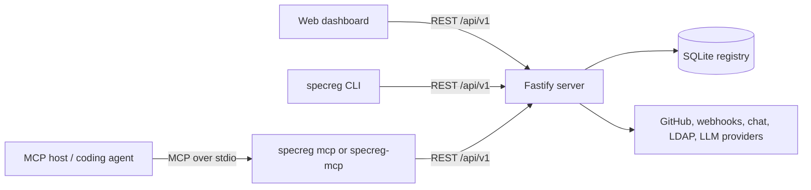
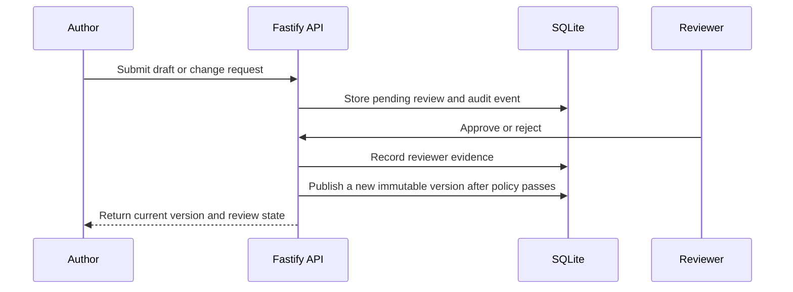
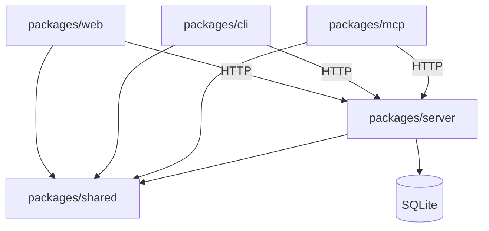

<!-- generated by SpecRegistry — do not edit by hand; run `specreg sync` to refresh. -->

# Web App Standard — Governed Specifications

This file is compiled from the organization's governed specification registry for the project type **Web App Standard**. Treat every section as authoritative guidance. If you find a contradiction or ambiguity while working, report it through the SpecRegistry feedback channel (MCP tool `report_spec_feedback` or POST /api/v1/ai/feedback) instead of guessing.

_Compiled 2026-07-30T22:19:57.574Z · AGENT_OPERATING_RULES.md@2.0.0 · CODING_STANDARDS.md@1.0.0 · GLOBAL_SECURITY.md@1.0.0 · IMPLEMENTATION_EVIDENCE.md@1.0.0 · PROJECT_PROFILE.md@1.0.0 · SDD_OPERATING_MODEL.md@1.0.0 · SECURITY_AND_SECRETS.md@1.0.0 · SPEC_AUTHORING_STANDARD.md@1.0.0 · SPEC_GOVERNANCE.md@1.0.0 · TOKENOMICS.md@1.0.0 · TRACEABILITY_AND_OBSERVABILITY.md@1.0.0 · API.md@1.0.0 · DESIGN.md@2.0.0 · STRUCTURE.md@2.0.0_

## SpecRegistry Operating Rules

These rules govern how you use this compiled file with SpecRegistry:

1. Prefer MCP when available. Use the `specregistry` MCP server from `.mcp.json` to call `get_specs`, `search_specs`, `report_spec_feedback`, `get_audit_prompt`, and `report_token_usage` when token counts are available.
2. Load live specs before non-trivial code changes. This compiled file is a bootstrap, but MCP is the live retrieval and feedback channel.
3. Preserve project scope. Ensure MCP is using the configured project type and repo/project identity so global, project-type, and project-scoped specs are all visible.
4. Search before assuming. Use `search_specs` in hybrid mode for task terms, APIs, filenames, security concerns, failure modes, and acceptance criteria before deciding guidance is missing.
5. Do not edit generated governance files by hand. Refresh `CLAUDE.md`, `AGENTS.md`, `.cursorrules`, and governed `specs/` content with `specreg sync` or `specreg compile`.
6. Treat spec drift as a blocker. If local specs appear stale, ask for or run `specreg check` / `specreg sync` before relying on them.
7. Report spec problems through SpecRegistry. If guidance is unclear, incomplete, contradictory, or outdated, call `report_spec_feedback` instead of guessing.
8. Follow published specs until they change. Feedback and draft fixes do not override the source of truth until a reviewed spec update is published and synced.
9. Use governed agent skills when available. Load relevant procedures from `.spec/skills/*/SKILL.md`; a skill organizes a workflow but never grants permission for destructive, privileged, or external actions.

## Agent Decision Gate

Before coding, verify the applicable specs are clear, complete, consistent, and current.

Proceed only when you can state: "For this task, spec <filename>@<version> section <section> requires <behavior>, and the implementation will satisfy it by <specific action/test>."

File SpecRegistry feedback instead of guessing when any gate fails:

| Gate | Proceed when | File feedback when |
| --- | --- | --- |
| Clear | The relevant section gives a single actionable rule, requirement, or acceptance criterion. | The spec is vague, leaves a key decision open, or supports multiple reasonable interpretations. |
| Complete | Inputs, outputs, boundaries, non-goals, failure behavior, and acceptance expectations are sufficient for the change. | Required details are missing, such as status codes, data shape, ownership, security behavior, or test expectations. |
| Consistent | Global, project-type, and project-scoped specs can all be followed at the same time. | Two specs, two sections, or a spec and project override require incompatible behavior. |
| Current | Referenced files, APIs, commands, architecture, and operational assumptions still match the codebase or are explicitly targeted future state. | The spec points to removed APIs, renamed files, obsolete workflows, stale infrastructure, or superseded behavior. |

Feedback type mapping:

- Use `ambiguity` when the Clear or Complete gate fails.
- Use `contradiction` when the Consistent gate fails.
- Use `outdated` when the Current gate fails.

When reporting feedback, include the affected `spec_id`, what you were trying to do, the exact unclear/conflicting/outdated guidance, relevant code or spec context, and the decision you needed from the spec.

---

<!-- AGENT_OPERATING_RULES.md v2.0.0 (global) -->

# Agent Operating Rules

## Scope

This specification applies to AI agents and automated tools working in repositories
governed by SpecRegistry.

## Intent

Agents must use current, reviewed context; preserve authorization and review boundaries;
produce verifiable evidence; and report missing or contradictory guidance instead of
silently guessing.

## Requirements

1. Before implementation, an agent must load the governed specs for the applicable project
   type and concrete repository through MCP or a verified generated context file.
2. The agent must call `get_specs` or `begin_task` before governed work and use
   `search_specs` or `resolve_guidance` when the initial context does not answer a focused
   question.
3. Concrete repositories must supply `SPECREG_REPO` so project-scoped guidance is loaded in
   addition to global and project-type specs.
4. Auth-required registry clients use `SPECREG_TOKEN` or an explicit bearer token. Agents
   must not print, commit, or copy token values into reports, specs, or generated context.
5. Drift, invalid bundle signatures, and local governed-file hash mismatches are blockers
   until synchronized or explicitly resolved through the governance workflow.
6. Ambiguity, contradiction, outdated guidance, missing intent, and missing coverage must
   be reported with `report_spec_feedback` or the equivalent agent API.
7. Agents must not bypass review, approval policy, separation of duties, RBAC, repository
   scope, audit logging, or protected-branch controls.
8. Completion claims must include the relevant spec mapping, actual build/test/check
   outcomes, failed or skipped checks, assumptions, and residual risks.
9. When compliance or traceability gates apply, the agent must run them and must not convert
   a failed result into a successful completion claim.
10. Skills and generated guidance structure a workflow but do not grant tool permission or
    override published specifications.

## Non-Goals

- Requiring agents to load every reference spec into every prompt.
- Granting production, deployment, merge, or secret access.
- Allowing locally inferred conventions to replace missing governed guidance.

## Acceptance Evidence

- Agent sessions or context events show the governing specs loaded for the repository.
- Feedback records capture unresolved ambiguity, contradiction, staleness, or gaps.
- Change summaries cite relevant specs and include observed verification results.
- Auth-required MCP/CLI configuration uses token indirection without exposing token values.
- Compliance and trace reports identify drift and unmapped implementation surfaces.

## Token Budget Class

Global invariant. Load by default because it controls how agents acquire and apply all other
governed context.

## Related Specs

- `SDD_OPERATING_MODEL.md`
- `IMPLEMENTATION_EVIDENCE.md`
- `SECURITY_AND_SECRETS.md`
- `TRACEABILITY_AND_OBSERVABILITY.md`

## AI Agent Directives

Load current governed context before changing implementation. Search when focused guidance
is missing. Report uncertainty rather than inventing policy. Preserve human approval and
host authorization boundaries, and finish with concrete evidence instead of unsupported
assurance.

---

<!-- CODING_STANDARDS.md v1.0.0 (global) -->

# General Coding Standards

## Principles
- Prefer clarity over cleverness; code is read far more than it is written.
- Every public interface requires documentation in the repository's spec files.
- All changes ship with tests that exercise the changed behavior.

## Versioning
All specification documents follow strict Semantic Versioning (MAJOR.MINOR.PATCH).
Breaking guidance changes are MAJOR; new guidance is MINOR; clarifications are PATCH.

## Reviews
No specification becomes active without an approved review in SpecRegistry.

---

<!-- GLOBAL_SECURITY.md v1.0.0 (global) -->

# Global Security Standards

## Scope
These rules apply to every project in the organization, regardless of project type.

## Requirements
1. **Secrets** must never be committed to source control. Use the approved secret manager.
2. **Dependencies** must be pinned and scanned weekly for CVEs.
3. **Network services** must default to TLS 1.2+ and deny-by-default firewall rules.
4. **Authentication** flows must be reviewed by the security team before release.

## AI Agent Directives
AI agents generating code MUST refuse to embed credentials and MUST flag any spec
contradiction via the feedback endpoint rather than guessing.

---

<!-- IMPLEMENTATION_EVIDENCE.md v1.0.0 (global) -->

# Implementation Evidence

## Scope
This specification applies to pull requests, change summaries, audit results, code trace reports, generated specs, and any delivery evidence attached to governed implementation work.

## Intent
Completed work should prove what changed, which specs governed it, what was verified, and what remains uncertain. Evidence prevents plausible but unverified compliance claims.

## Requirements
1. Change summaries must list relevant specs or state that a spec gap was reported.
2. Test, lint, build, audit, and code trace commands must be reported with actual outcomes.
3. Failed or skipped checks must be called out as residual risk, not omitted.
4. Work that changes APIs, schemas, commands, config, security posture, or architecture boundaries must include corresponding spec or feedback evidence.
5. Generated specs and examples must be reviewed separately from implementation evidence.
6. CI annotations should identify drift, unmapped code entities, stale local specs, and audit findings when available.
7. Reviewers must be able to trace acceptance evidence back to specific spec sections or explicit gaps.
8. Git commit messages for implementation work must include compact SpecRegistry compliance evidence: the `SpecRegistry-Compliance:`, `SpecRegistry-Signals:`, and `SpecRegistry-Command:` trailer emitted by `specreg comply`, or equivalent `finish_task` evidence with verdict, objective score, and session id.

## Non-Goals
This spec does not prescribe a single PR template. It defines the minimum evidence required for SDD confidence.

## Acceptance Evidence
- PR/change summaries include commands run and observed results.
- Code trace coverage is uploaded for repositories where `specreg code-map --report` is available.
- Missing or ambiguous specs create feedback items or draft specs rather than hidden assumptions.
- Migration checklists accompany breaking spec changes.

## Token Budget Class
Workflow rule. Load for implementation, review, CI, and audit tasks.

## Related Specs
- `SDD_OPERATING_MODEL.md`
- `TRACEABILITY_AND_OBSERVABILITY.md`
- `SPEC_GOVERNANCE.md`

## AI Agent Directives
Never say a check passed without observed output. Include spec mapping, commands run, failures, skipped checks, and remaining risks in the final work summary.

---

<!-- PROJECT_PROFILE.md v1.0.0 (global) -->

# Project Profile

## Scope
This specification defines the standard project-scoped profile that `specreg init` drafts for a concrete repository.

## Intent
A repository's profile captures the local choices that make generic project-type guidance specific: product intent, stack, data stores, runtime, deployment, compliance posture, agent skills, and explicit non-goals.
Project types are reusable baselines; projects are concrete repositories. The profile keeps a project from accidentally turning its baseline into a one-off project definition.

## Requirements
1. Every initialized repository should submit a project-scoped `PROJECT_PROFILE.md` draft for review.
2. The profile must identify project type, repository identity, lifecycle stage, users, platforms, languages, frameworks, databases, APIs, infrastructure, tests, observability, security, privacy, and non-goals.
3. The profile is not governed until reviewed and published.
4. Material changes to stack, platform, deployment, data stores, external interfaces, or compliance scope must update the profile through review.
5. Project profile guidance may narrow project-type guidance only for the attached repository and only when explicit.
6. Agents must not invent missing project profile choices; they must report ambiguity or ask for a reviewed profile change.
7. A project type should not be named after a single repository or product unless it is intentionally a reusable family name.
8. Specs that mention repo-specific routes, deployment hosts, credentials, local model catalogs, customers, research goals, or product behavior must be project-scoped unless at least one other project is expected to inherit the same rule.

## Non-Goals
This profile is not a replacement for technical contract specs such as API, database, security, observability, or architecture specs.

## Acceptance Evidence
- `specreg init` creates a structured profile draft.
- The profile is submitted as project-scoped draft or review request.
- Reports show the concrete project as a consumer attached to a project type.
- Agent summaries respect published project-scoped profile constraints.
- Dashboard project pages show inherited global/project-type specs separately from project-scoped specs.

## Token Budget Class
Project contract. Load for the attached repository; do not load for unrelated repositories.

## Related Specs
- `SDD_OPERATING_MODEL.md`
- `SPEC_GOVERNANCE.md`
- `AGENT_OPERATING_RULES.md`

## AI Agent Directives
Treat a published project profile as repository-specific guidance. Treat an unpublished generated profile as draft evidence only. Report conflicts between profile choices and global or project-type specs.

---

<!-- SDD_OPERATING_MODEL.md v1.0.0 (global) -->

# SDD Operating Model

## Scope
This specification applies to every repository, project type, global spec, project-scoped spec, and agent workflow governed by SpecRegistry.

## Intent
Spec Driven Development succeeds only when implementation work is traceable to current, reviewed, measurable specifications. The registry is the control plane for that loop, not a passive document store.

## Requirements
1. Every governed repository must initialize through `specreg init` or an equivalent reviewed automation path.
2. Every implementation task must identify the current governed spec set before code, configuration, tests, or generated artifacts are changed.
3. Local governed specs must come from the registry bundle and manifest, not from hand-edited local files.
4. Drift reported by `specreg check` is a blocking SDD failure until synchronized, explicitly waived, or resolved by reviewed spec changes.
5. Generated draft specs must remain outside the governed `specs/` directory until submitted through the registry workflow.
6. Ambiguity, contradiction, outdated guidance, or missing coverage must be reported as spec feedback instead of guessed around.
7. Spec changes must use review, approval policy, semver classification, audit log, and publish workflow before they become active guidance.

## Non-Goals
This spec does not define technology-specific architecture, coding style, or runtime behavior. Project-type and project-scoped specs define those contracts.

## Acceptance Evidence
- A repository contains `specs/.specregistry.json` from the registry.
- CI runs `specreg check` and fails on manifest, signature, or version drift.
- Review summaries cite affected specs or state that a gap was reported.
- Generated drafts appear under `.spec/drafts` or the registry draft workflow, not as direct edits to governed specs.

## Token Budget Class
Global invariant. Keep loaded by default for agents because it defines how all other specs are trusted.

## Related Specs
- `AGENT_OPERATING_RULES.md`
- `SPEC_GOVERNANCE.md`
- `TRACEABILITY_AND_OBSERVABILITY.md`

## AI Agent Directives
Before implementation, load governed specs through MCP or generated context. If drift is detected, stop and ask for synchronization. If a required spec is missing or contradictory, file feedback and do not invent the missing rule.

---

<!-- SECURITY_AND_SECRETS.md v1.0.0 (global) -->

# Security and Secrets

## Scope
This specification applies to credentials, API keys, registry tokens, LDAP bind settings, webhook secrets, local LLM endpoints, hosted LLM providers, Docker deployments, and generated agent configuration.

## Intent
SpecRegistry must let agents and humans work with governed context without leaking credentials or confusing local development settings with deployable server settings.

## Requirements
1. Secrets must never be committed to source control, generated specs, compiled agent context, screenshots, logs, or code trace reports.
2. Auth-required registries must use `SPECREG_TOKEN` or explicit bearer tokens for CLI and MCP clients.
3. Generated MCP and agent pack content must use `SPECREG_PUBLIC_URL` or the externally reachable registry URL, not an unreachable bind address.
4. API keys configured in the UI must be obfuscated when displayed after save.
5. LDAP bind passwords, webhook secrets, LLM API keys, and app integration secrets must be treated as sensitive settings.
6. Local or network LLM endpoints must be explicit and must not silently send sensitive code/specs to unintended providers.
7. Docker deployments must document hostname, port, public URL, auth mode, token path, and persistent database volume.
8. Security contradictions must be reported as spec feedback before implementation proceeds.

## Non-Goals
This spec does not replace organization-specific security policy, threat modeling, or compliance requirements.

## Acceptance Evidence
- README/deployment docs show `SPECREG_PUBLIC_URL`, `SPECREG_AUTH`, and `SPECREG_TOKEN` paths.
- Saved secrets display only presence/obfuscated state.
- Agent-generated files do not contain raw tokens or keys.
- Security feedback is filed when global and project guidance conflict.

## Token Budget Class
Global invariant. Load by default because accidental secret leakage and auth drift are high-impact failures.

## Related Specs
- `AGENT_OPERATING_RULES.md`
- `SDD_OPERATING_MODEL.md`
- `IMPLEMENTATION_EVIDENCE.md`

## AI Agent Directives
Refuse to print, persist, or invent secrets. When configuring MCP, CLI, LLM, LDAP, Docker, or webhook behavior, preserve token indirection and call out missing auth or public URL settings.

---

<!-- SPEC_AUTHORING_STANDARD.md v1.0.0 (global) -->

# Spec Authoring Standard

## Scope
This specification applies to all Markdown specifications authored, generated, reviewed, or published through SpecRegistry.

## Intent
Specs should constrain implementation, preserve intent, and earn their prompt budget. A good spec is specific enough to audit and short enough to use.

## Requirements
1. Every spec must state its scope and the outcome it protects.
2. Every spec must separate requirements from examples, references, and non-goals.
3. Every normative rule must be testable, auditable, or reviewable as evidence.
4. Every spec should include acceptance evidence describing how humans, CI, or agents verify conformance.
5. Specs must identify their token budget class: global invariant, project contract, workflow rule, reference detail, or temporary migration.
6. Specs that intentionally narrow or override broader guidance must say so explicitly and name the broader spec.
7. Generated specs must be reviewed for intent, contradictions, examples, and token cost before publication.
8. Specs should avoid volatile implementation details unless those details are the contract.

## Non-Goals
This spec is not a writing style guide for prose polish. It defines the minimum structure required for governed, observable SDD.

## Acceptance Evidence
- New specs contain scope, intent, requirements, non-goals, acceptance evidence, token budget class, related specs, and AI directives.
- Reviewers can identify at least one concrete way to audit each requirement.
- Search results can return meaningful sections because headings are specific.

## Token Budget Class
Global invariant. Load by default for spec generation, review, and draft-fix work.

## Related Specs
- `SPEC_GOVERNANCE.md`
- `TOKENOMICS.md`
- `TRACEABILITY_AND_OBSERVABILITY.md`

## AI Agent Directives
When generating or editing specs, preserve the required sections. Do not convert examples into requirements unless the user or reviewer explicitly asks for that contract.

---

<!-- SPEC_GOVERNANCE.md v1.0.0 (global) -->

# Spec Governance

## Scope
This specification applies to review, approval, publication, promotion, deletion, and downstream synchronization of governed specs.

## Intent
SpecRegistry must make rule changes deliberate, reviewable, versioned, and explainable. A spec is source-of-truth only after it passes governance.

## Requirements
1. Draft specs may be edited directly until submitted for review or published.
2. Published specs must change through change requests, not direct mutation.
3. Semver deltas must match impact: major for breaking or removed guidance, minor for new compatible guidance, patch for clarifications.
4. Reviewers must inspect diff, compatibility, contradiction findings, impact analysis, required approvals, and migration checklist before publication.
5. Project-scoped specs may override only the attached repository and must not silently change a project type's shared baseline.
6. Global specs apply to every project type unless a reviewed project-type or project-scoped spec explicitly narrows the rule.
7. Deletions must preserve audit history and must not be treated as proof that old implementations were compliant.
8. Webhooks, sync jobs, and downstream PRs must carry enough summary context for consumers to verify the change.
9. Project types must represent reusable baselines for a family of similar repositories, not one-off product instances.
10. Product-specific behavior, local deployment choices, repo-only API contracts, and implementation constraints must be captured as project-scoped specs attached to the concrete repository.
11. When a project-type spec starts to describe only one repository, reviewers should split the reusable baseline guidance from the project-specific guidance before publication.

## Non-Goals
This spec does not define individual reviewer identities or approval counts. Approval policies define those details.

## Acceptance Evidence
- Published changes have change request records, approvals, semver delta, and audit log entries.
- Publish preview identifies affected consumers, dependencies, feedback, usage, and migration steps.
- Project-scoped specs appear in reports as project-specific, not project-type-wide.

## Token Budget Class
Workflow rule. Load for spec review, approval, publishing, and migration tasks.

## Related Specs
- `SDD_OPERATING_MODEL.md`
- `SPEC_AUTHORING_STANDARD.md`
- `IMPLEMENTATION_EVIDENCE.md`

## AI Agent Directives
Do not bypass the registry workflow. When a requested spec edit affects published guidance, submit a review or draft according to the existing lifecycle instead of overwriting governed files.

---

<!-- TOKENOMICS.md v1.0.0 (global) -->

# Tokenomics

## Scope
This specification applies to how specs are loaded, searched, summarized, split, promoted, demoted, and evaluated for usefulness in agent workflows.

## Intent
Spec context is a scarce budget. Specs must earn their tokens by improving decisions, reducing ambiguity, and preventing drift without overwhelming agents.

## Requirements
1. Always-loaded specs must be compact, stable, and broadly applicable.
2. Large reference specs should be searchable and section-addressable rather than blindly loaded into every prompt.
3. Each spec must declare a token budget class and should be split when unrelated concerns compete for attention.
4. Token ROI should consider reads, searches, feedback frequency, efficacy lift, stale age, and audit findings.
5. Specs with repeated ambiguity feedback or low efficacy lift must be candidates for revision, splitting, or demotion to reference material.
6. Agent workflows should prefer focused search results for task-specific detail.
7. Generated context files must not hide drift or replace the signed manifest as the authority.
8. Temporary migration guidance must include a review or expiration expectation.

## Non-Goals
This spec does not minimize tokens at the expense of safety, compliance, or correctness. Critical invariants may deserve default loading.

## Acceptance Evidence
- Specs declare token budget class.
- Reports expose token ROI, search/read counts, stale specs, and feedback trends.
- Large specs have headings that search can retrieve independently.
- Reviewers can justify why a spec is always-loaded or search-first.

## Token Budget Class
Global invariant for context economics. Load for spec authoring, agent context design, and report review.

## Related Specs
- `SPEC_AUTHORING_STANDARD.md`
- `AGENT_OPERATING_RULES.md`
- `TRACEABILITY_AND_OBSERVABILITY.md`

## AI Agent Directives
Use the smallest governed context that can safely answer the task. If context is too broad, search specs by task terms and cite the retrieved sections.

---

<!-- TRACEABILITY_AND_OBSERVABILITY.md v1.0.0 (global) -->

# Traceability and Observability

## Scope
This specification applies to manifests, MCP/spec reads, searches, feedback, audits, code trace reports, metrics, and reports that explain whether SDD is working.

## Intent
The registry must show which specs governed which work, whether code is covered by specs, when specs drift or conflict, and when a spec is followed literally but fails to express the intended outcome.

## Requirements
1. Governed repositories must report manifest usage through `specreg check`, `specreg sync`, or equivalent automation.
2. Repositories should run `specreg code-map --report` when code metadata is available so implementation surfaces can be linked to specs.
3. Reports must expose project spec drift, code-to-spec coverage, code drift severity, unmapped code entities, open feedback, pending reviews, stale specs, and token ROI signals.
4. Feedback must preserve spec, version, actor/agent, issue type, description, and context evidence.
5. Audit prompts and conformance audits should cite exact spec sections when possible.
6. Metrics endpoints must expose SDD health signals in a form Prometheus/Grafana can scrape or receive through an approved collector.
7. Traceability sidecars must not rewrite source files unless an explicit inline metadata workflow is enabled and reviewed.
8. Perfect spec compliance with wrong user or operational outcome must be recorded as a spec flaw or missing-intent feedback.

## Non-Goals
This spec does not require surveillance of developer behavior. It requires explainable evidence for governed decisions and repeated SDD failures.

## Acceptance Evidence
- Reports show current manifest consumers and code trace summaries.
- `.spec/code-trace.json` includes links, coverage, drift, aliases, and unmapped entities when generated.
- Feedback clusters can be triaged into spec changes, code changes, or intentional waivers.
- Metrics include registry, review, usage, and SDD health counts.

## Token Budget Class
Global invariant plus reporting contract. Load for audit, reports, CI, and governance work; search-first for detailed telemetry tables.

## Related Specs
- `SDD_OPERATING_MODEL.md`
- `IMPLEMENTATION_EVIDENCE.md`
- `TOKENOMICS.md`

## AI Agent Directives
When work changes code structure, APIs, schemas, commands, or config, prefer generating a code trace report and mention unmapped entities. Report missing spec coverage instead of pretending all code is governed.

---

<!-- API.md v1.0.0 (Web App Standard) -->

# Web App Standard — API Specification

## Scope
This specification governs REST or JSON API endpoints in Web App Standard projects.

## Endpoints
Every endpoint spec must list method, path, purpose, authentication requirements, request shape,
response shape, and compatibility expectations. Health/readiness endpoints must return stable JSON
and documented status codes.

## Request and Response Contracts
Request validation belongs at the API boundary. Response payloads must be stable, typed or
schema-described, and covered by tests. Breaking response or path changes require a major spec delta.

## Errors
Unknown routes must return a documented 404 shape. Validation and authorization failures must use
consistent JSON error payloads and must not leak secrets or internal stack traces.

## Traceability
Route declarations, API handlers, response helpers, and package commands that serve the API should
map to the governing project or project-type API spec.

---

<!-- DESIGN.md v2.0.0 (project:github.com/joeldg/SpecRegistry) -->

# SpecRegistry System Architecture and Design

## Scope

This specification governs the architecture of SpecRegistry itself. SpecRegistry is a
TypeScript monorepo that manages versioned Markdown specifications, distributes governed
context to developers and agents, records review and compliance evidence, and exposes that
state through a web application, CLI, REST API, and Model Context Protocol (MCP) server.

## Architectural Outcomes

The system must preserve these outcomes:

1. Published specifications remain the reviewed source of truth.
2. Project-specific guidance is isolated from reusable project-type and global guidance.
3. Every distributed bundle is attributable to exact spec versions and content hashes.
4. Review, approval, publication, feedback, compliance, and administrative actions remain
   auditable.
5. Agent integrations use bounded registry APIs instead of direct database access.
6. Deployments can require authentication without embedding credentials in generated files
   that are intended for source control.

## Runtime Architecture



### Package Responsibilities

| Package | Responsibility |
| --- | --- |
| `packages/server` | Fastify REST API, SQLite persistence and migrations, authentication and RBAC, review workflow, audit evidence, integrations, metrics, and production static-web serving. |
| `packages/web` | React/Vite management dashboard using the server REST API. |
| `packages/cli` | `specreg` developer workflow: initialization, sync, verification, compilation, traceability, compliance, audits, and embedded MCP serving. |
| `packages/mcp` | Legacy standalone MCP stdio server that translates MCP tool calls into registry REST requests. |
| `packages/shared` | Shared TypeScript domain types and deterministic helpers used across packages. |

The packages communicate through explicit interfaces. The web client, CLI, and MCP servers
must not open or mutate the registry SQLite database directly.

## Server Design

The server is built with Fastify. `packages/server/src/app.ts` constructs the application,
registers cross-origin policy and request authentication, and mounts route families under
`/api/v1`. `packages/server/src/index.ts` owns process startup, secure-posture checks,
backup scheduling, and listening on the configured port.

SQLite is accessed through `better-sqlite3`. Schema creation and append-only migrations live
in `packages/server/src/db.ts`. The server uses WAL mode and parameterized statements.
Routes may compose deterministic helpers, but durable state changes must continue to honor
review, audit-log, and scope semantics.

Important durable entities include:

- `project_types`: reusable baselines plus the global scope.
- `repo_consumers`: concrete repositories attached to a project type.
- `specs` and `spec_versions`: current specifications and immutable published history.
- `change_requests` and `review_approvals`: proposed changes and approval evidence.
- `agent_feedback`, `audit_reports`, `audit_log`, and compliance/trace tables: governance
  evidence.
- `users` and `tokens`: identities and hashed bearer-token records.
- governed skill identities, versions, assignments, sources, and candidates.

Database migrations must be additive. Existing review, approval, audit, feedback, and
traceability records must not be rewritten merely to simplify a feature.

## Specification Lifecycle



An update to a published specification must go through a change request. Required reviewer
counts, separation of duties, stable/beta channel behavior, and audit attribution are
enforced by the server. Initial project-scoped specifications may be published only through
the explicit workflow supported for enrolled agents and authorized actors.

## Distribution and Integrity

The server distributes governed specs as downloads, compiled context, agent packs, search
results, and MCP responses. Downloads include `specs/.specregistry.json` containing exact
versions and SHA-256 content hashes. The signed manifest payload uses Ed25519; local
`specreg verify` checks both file hashes and the signature against the originating
registry's public key.

Generated MCP and agent guidance must use the effective public registry URL. Resolution
follows `SPECREG_PUBLIC_URL`, forwarded host/protocol headers, and finally the local bind
address. Auth-required deployments use bearer tokens supplied with `--token` or
`SPECREG_TOKEN`.

## CLI Design

`packages/cli/src/index.ts` parses commands and delegates to focused modules. Major command
families include:

- Repository onboarding and currency: `init`, `check`, `sync`, and `migrate`.
- Context and draft workflows: `generate`, `compile`, and `submit-drafts`.
- Traceability and governance: `code-map`, `trace-check`, `comply`, `audit`, and
  `audit-report`.
- Agent integration: `mcp`.
- Governed skills and advisory style-guide management.

The CLI reads and writes local repository artifacts but communicates with registry state
through REST. It must use `SPECREG_TOKEN` or `--token` for authenticated registries and must
not invent a separate authentication convention.

## MCP Design

Generated configurations prefer `specreg mcp`; `packages/mcp` remains the standalone legacy
binary. Both implementations are MCP stdio adapters over the registry REST API.

Core tools include governed context loading and search (`begin_task`, `get_specs`,
`search_specs`, and `resolve_guidance`), feedback reporting, governed skill discovery, token
usage reporting, and compliance/session evidence. MCP implementations must send
`SPECREG_TOKEN` as a bearer token when configured and use `SPECREG_REPO` to request the
correct project-scoped context.

MCP tools must not query SQLite directly. The REST API remains the authorization,
observability, and scope boundary.

## Web Design

The web package is a React application built by Vite. It obtains all registry state through
`packages/web/src/api.ts`. Page components cover specs, reviews, feedback, reports,
projects, baselines, skills, templates, and settings.

The dashboard is an administrative presentation layer, not a second business-logic
implementation. Server responses remain authoritative for authorization, lifecycle rules,
and persisted evidence.

## Authentication and Authorization

Requests authenticate with bearer tokens or `x-api-key`; stored token material is hashed.
The server supports local users and optional LDAP authentication with the roles `agent`,
`author`, `reviewer`, and `admin`. Route policies in `packages/server/src/lib/auth.ts` define
minimum roles, while project-scoped agent mutations receive additional repository-scope
checks in their handlers.

When `SPECREG_AUTH=required`:

- Non-public routes require a valid, unexpired token.
- The server must refuse insecure default-admin posture at startup.
- Administrative settings, user/key management, audit evidence, and operational controls
  require the admin role.
- Generated and documented clients use `SPECREG_TOKEN`; credentials are not committed.

Secrets stored in settings may be encrypted at rest with `SPECREG_SECRET_KEY`. Public
configuration responses expose presence/status metadata rather than secret values.

## Observability and Operations

`GET /metrics` exposes Prometheus metrics. The registry also records audit-log entries,
context delivery, real LLM token usage when available, feedback, compliance attestations,
trace reports, and deterministic audit reports.

Backups use SQLite's online backup API, checksum sidecars, retention, and optional scheduled
execution. Public URL configuration, server version checks, LLM providers, application
keys, LDAP, feature flags, and backup controls are managed through admin-only routes.

## Architecture Invariants

- Fastify is the only HTTP server framework for the registry API.
- SQLite access is owned by `packages/server`.
- MCP, CLI, and web clients use registry APIs rather than direct database access.
- Shared types must remain free of runtime dependencies on the other internal packages.
- Authentication uses registry bearer/API tokens, not JWT or custom HMAC request signing.
- Published spec changes preserve immutable version history and review evidence.
- Generated context remains aware of public URL and token configuration.
- Operational and governance evidence must be classified from explicit event semantics,
  not incidental words in human-readable summaries.

## AI Agent Directives

Before changing a package boundary, route contract, authentication behavior, database
schema, review workflow, bundle format, or MCP tool, compare the change with this
specification and the product specification in `docs/SPEC.md`. Report contradictions or
outdated guidance instead of implementing around them. Update architecture documentation
in the same reviewed change whenever a public interface or durable invariant changes.

---

<!-- STRUCTURE.md v2.0.0 (project:github.com/joeldg/SpecRegistry) -->

# SpecRegistry Codebase Structure

## Scope

This specification maps the repository's package boundaries, entry points, configuration,
tests, sidecars, and dependency direction. It is descriptive where paths are expected to
exist and normative where ownership boundaries prevent architectural drift.

## Repository Layout

```text
SpecRegistry/
├── packages/
│   ├── cli/                 # specreg command-line application and embedded MCP server
│   ├── mcp/                 # legacy standalone MCP stdio server
│   ├── server/              # Fastify API, SQLite data model, integrations, and operations
│   ├── shared/              # shared TypeScript types and pure helpers
│   └── web/                 # React/Vite dashboard
├── docs/                    # user, developer, API, operations, and product documentation
├── specs/                   # governed specifications for this repository
├── samples/ai-sdd/          # sample specification pack and loader
├── config/alloy/            # formal model and Alloy checks
├── .github/                 # CI workflow and bundled SpecRegistry check action
├── Dockerfile               # production container build
├── docker-compose.yml       # local/container deployment composition
├── package.json             # npm workspace scripts
└── tsconfig.base.json       # shared TypeScript compiler options
```

Generated build output, local databases, credentials, MCP configuration, and local
traceability artifacts are not source modules. Their ignore/tracking policy must remain
explicit so governed specs are not confused with transient agent output.

### Sidecar and Metadata Artifacts

| Artifact | Format | Purpose |
| --- | --- | --- |
| `.spec/code-map.json` | Schema V2 dictionary JSON | Compact AST/code-entity inventory with deduplicated strings and tuples. |
| `.spec/code-trace.json` | Schema V2 dictionary JSON | Compact graph linking code entities to governed specs, coverage, and drift metrics. |
| `.spec/code-map.sqlite` | SQLite | Local zero-token index for CLI lookups and compliance checks. |
| `.spec/trace-overrides.json` | JSON | Explicit reviewed link overrides and waivers for traceability. |

Sidecars are local or generated evidence, not registry persistence. Their schemas and
tracking policy are governed by `OBSERVABILITY_AND_TRACEABILITY.md`.

## Package Entry Points

| Package | Runtime entry | Supporting entry points |
| --- | --- | --- |
| CLI | `packages/cli/src/index.ts` | Command modules under `packages/cli/src`; published binary name `specreg`. |
| MCP | `packages/mcp/src/index.ts` | Published legacy binary `specreg-mcp`; generated configs prefer `specreg mcp`. |
| Server | `packages/server/src/index.ts` | `app.ts` builds Fastify; `db.ts` owns schema/migrations; `seed-cli.ts` and `backup-cli.ts` provide operational commands. |
| Web | `packages/web/src/main.tsx` | `App.tsx` owns routing/layout; `api.ts` owns REST calls; page modules live under `src/pages`. |
| Shared | `packages/shared/src/index.ts` | Shared types and helpers exported for workspace consumers. |

Each workspace has its own `package.json` and `tsconfig.json`. Root scripts orchestrate
workspace builds and tests.

## Server Structure

```text
packages/server/src/
├── app.ts                   # Fastify construction and route registration
├── index.ts                 # environment startup, posture checks, scheduler, listen
├── db.ts                    # SQLite schema and append-only migrations
├── env.ts                   # environment-file loading and configuration
├── seed.ts                  # idempotent baseline/demo data
├── seed-cli.ts              # seed command entry
├── backup-cli.ts            # backup/verify/restore command entry
├── routes/                  # HTTP handlers grouped by domain
└── lib/                     # reusable domain, integration, security, and report helpers
```

Route modules currently cover project types, projects, specifications, reviews, feedback,
automation, skills, administrative/reporting APIs, authentication, integrations, and
metrics. New routes belong in the closest domain module and must be registered in
`app.ts`.

Database schema changes belong only in `db.ts` and must be append-only. Cross-route logic
that represents a durable rule belongs in `lib/` rather than being copied between
handlers.

## CLI Structure

`packages/cli/src/index.ts` owns argument parsing and command dispatch. Focused modules own
individual workflows, including initialization, synchronization, compilation, verification,
draft submission, code mapping, compliance, audits, migrations, skills, style guides, and
MCP serving.

CLI modules may:

- Read repository files and Git metadata.
- Write generated local artifacts in documented locations.
- Call registry REST endpoints through the shared CLI request helper.

CLI modules must not import server internals or open the registry database.

Tests live under `packages/cli/test` and use Node's test runner.

## MCP Structure

`packages/mcp/src/index.ts` is a standalone stdio MCP adapter. The CLI has an embedded MCP
implementation in `packages/cli/src/mcp.ts`. Both call the registry over HTTP and use the
same public environment conventions:

- `SPECREG_SERVER` for the registry URL.
- `SPECREG_TOKEN` for bearer authentication.
- `SPECREG_REPO` for concrete project context.

Neither MCP implementation owns registry persistence.

## Web Structure

```text
packages/web/src/
├── main.tsx                 # React bootstrap
├── App.tsx                  # application shell and routes
├── api.ts                   # typed REST client
├── components.tsx           # shared dashboard components
├── styles.css               # application styles
└── pages/                   # domain pages and report/settings views
```

Business rules and authorization remain server-owned. Web code should render server state,
collect user intent, and call typed API helpers rather than duplicating lifecycle decisions.

## Dependency Direction



`packages/shared` is the internal leaf dependency and must not import the server, CLI, MCP,
or web packages. Runtime clients may depend on shared contracts, but only the server owns
SQLite and privileged integration configuration.

The web, CLI, and MCP packages must remain independently buildable after `packages/shared`
has been built.

## Tests and Verification

| Area | Location / command |
| --- | --- |
| Full TypeScript and web build | `npm run build` |
| Full workspace tests | `npm test` |
| Server tests | `packages/server/test`, run through the server workspace |
| CLI tests | `packages/cli/test`, run through the CLI workspace |
| CI | `.github/workflows/ci.yml` |
| Governed bundle currency/integrity | `specreg check` and `specreg verify` |

Server behavior changes require tests. Public API, deployment, authentication, CLI/MCP,
or workflow changes require corresponding documentation updates.

## Configuration Boundaries

Runtime configuration is supplied through environment variables and settings persisted by
the server. Important deployment variables include:

- `PORT` and `SPECREG_DB`.
- `SPECREG_PUBLIC_URL`.
- `SPECREG_AUTH`, `SPECREG_ADMIN_PASSWORD`, and `SPECREG_TOKEN`.
- `SPECREG_SECRET_KEY`.
- Backup, LDAP, LLM, integration, and feature-specific variables documented in
  `docs/OPERATIONS.md`.

Do not repurpose generated client configuration as server configuration. `.mcp.json`,
`.spec/`, and local credentials belong to consuming-repository workflows.

## Ownership Rules

- `packages/server/src/db.ts` owns schema migration.
- `packages/server/src/lib/auth.ts` owns global role policy.
- Route handlers own domain validation and project-scoped authorization.
- `packages/web/src/api.ts` owns dashboard endpoint wiring.
- `packages/cli/src/registry.ts` owns CLI registry HTTP/auth behavior.
- `packages/cli/src/mcp.ts` and `packages/mcp/src/index.ts` must remain behaviorally aligned
  for shared MCP capabilities.
- `docs/` explains product and operator workflows; `specs/` states governed requirements.

## AI Agent Directives

Place changes in the package that owns the behavior and preserve the dependency direction
above. Before adding a new helper or route, search the owning package for an existing
implementation. Do not move database access into clients, duplicate authorization in the
dashboard, or create undocumented authentication variables. When repository structure
changes, update this specification in the same reviewed change.
