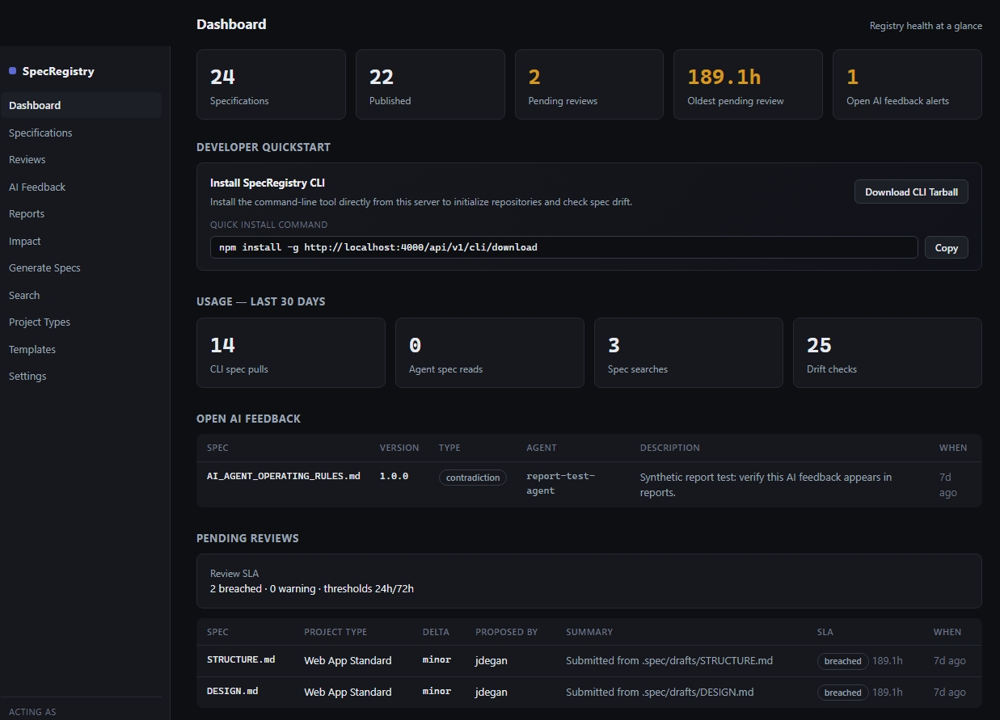

# SpecRegistry

SpecRegistry turns your project specifications into an AI-ready governance and control plane. Instead of hoping every agent, editor, prompt, and teammate remembers the same architecture rules, SpecRegistry gives your specs versioning, review gates, signed distribution, MCP access, drift checks, feedback loops, and observability. If you are building with AI, this is the missing layer that keeps generated work aligned with what you actually intended: approved
Markdown specs (`DESIGN.md`, `STRUCTURE.md`, `API.md`, and more) become governed context
that humans can review, developers can sync, and agents can load before they touch code.



> [!NOTE]
> Read the core philosophy behind SpecRegistry in the Medium article: [AI Coding Agents Need a Control Plane, Not Better Prompts](https://medium.com/@joeldg/ai-coding-agents-need-a-control-plane-not-better-prompts-bfaa8bb06951).
> 
> *"When an agent can generate a multi-file implementation from a Markdown design document, the spec becomes the real source of intent. The code is an artifact. The spec is the control surface."*
>
> Follow-up article: [Architecting out of the vibe: How to enforce compliance in AI-coded apps](https://medium.com/@joeldg/architecting-out-of-the-vibe-how-to-enforce-compliance-in-ai-coded-apps-42b9d0113321)

The full product specification lives in [docs/SPEC.md](docs/SPEC.md). The operating model
for Spec Driven Development, observability, and token economics lives in
[docs/SDD_TOKENOMICS.md](docs/SDD_TOKENOMICS.md).

## Start Here

SpecRegistry has three primary workflows:

1. Run a registry server and open the dashboard.
2. Initialize repositories with approved specs, MCP config, and governed skills.
3. Use reviews, compliance checks, reports, and feedback loops to keep agents aligned with current specifications.

For the full documentation set, start with [docs/README.md](docs/README.md).

## Quick Install

Local development:

```sh
npm install
cp .env.example .env
npm run build
npm run dev:server
# in another terminal
npm run dev:web
```

Open the development dashboard at `http://localhost:5173`.

Production-style Node:

```sh
npm install
npm run build
PORT=4000 SPECREG_DB=/var/lib/specregistry/specregistry.db node packages/server/dist/index.js
```

Docker:

```sh
cp .env.example .env
docker compose up --build
```

For server installs, set `SPECREG_PUBLIC_URL` or configure **Settings > Integrations > Server reachability** so generated agent packs never point at an unreachable loopback address.

## First-Time Setup

1. Start the server using the local, Node, or Docker path above.
2. Open the dashboard.
3. Sign in with `admin` / `admin`, or set `SPECREG_ADMIN_PASSWORD` before first run.
4. Create reusable baselines under **Baselines**.
5. Add concrete repositories under **Projects** so project-specific specs stay project-scoped.
6. Publish governed specs, configure policies, and initialize repositories with the CLI.

See [Install and Run](docs/INSTALL.md) for the complete setup guide.

## Common Paths

| I want to... | Go to |
| --- | --- |
| Run SpecRegistry locally, in Docker, or behind a public hostname | [Install and Run](docs/INSTALL.md) |
| Initialize a project and use `specreg` commands | [Developer Guide](docs/DEVELOPER_GUIDE.md) |
| Configure agents and MCP | [AI Agents and MCP](docs/AGENTS_MCP.md) |
| Call the REST API or configure auth | [API Reference](docs/API_REFERENCE.md) |
| Configure metrics, backups, LLM providers, env vars, LDAP, or feature flags | [Operations](docs/OPERATIONS.md) |
| Understand baselines, project scopes, compliance, traceability, and skills | [Concepts](docs/CONCEPTS.md) |
| Read the product-level contract | [Product Spec](docs/SPEC.md) |
| Review token budget and SDD observability requirements | [SDD Tokenomics](docs/SDD_TOKENOMICS.md) |

## Layout

| Package | Purpose |
| --- | --- |
| `packages/server` | Fastify API + SQLite storage, review workflow, signed bundles, AI feedback/draft-fix/audit/efficacy, FTS5 search, webhooks, analytics, auth + LDAP, git push-back, inbound git sync, Slack/GChat |
| `packages/web` | React management dashboard (specs, diffs, reviews, feedback, templates, settings, search, analytics, login, efficacy) |
| `packages/cli` | `specreg` developer CLI (`init`, `generate`, `code-map`, `check`, `sync`, `compile`, `verify`, `audit`, `mcp`) |
| `packages/mcp` | Legacy standalone `specreg-mcp` binary; generated configs prefer `specreg mcp` so the dashboard-downloaded CLI can run MCP directly |
| `packages/shared` | Shared TypeScript domain types + semver/range helpers |
| `samples/ai-sdd` | Loadable sample spec pack + API loader (`npm run sample:ai-sdd`) |

## Dashboard

Use the web dashboard to manage the registry:

- Create reusable baselines, concrete projects, and organization-wide global specs.
- Edit drafts and publish initial versions.
- Submit, review, approve, reject, and promote change requests.
- Triage AI feedback clusters.
- Configure templates, webhooks, repo subscriptions, compliance policies, approval policies, users, API keys, LDAP, LLM providers, and server reachability.
- Inspect usage analytics, token reports, review SLA risk, audit log entries, efficacy runs, and SDD metrics.

Typical local URLs:

```text
Development UI: http://localhost:5173
API and production UI: http://localhost:4000
Metrics: http://localhost:4000/metrics
```

## Essential CLI Flow

```sh
# From this repository
npm install
npm run build
npm link -w @specregistry/cli

# From an application repository
specreg init --server http://localhost:4000
specreg check
specreg comply
```

See [Developer Guide](docs/DEVELOPER_GUIDE.md) for generated drafts, migrations, audits, traceability, CI, and the full command catalog.

## Further Reading

- [AI Coding Agents Need a Control Plane, Not Better Prompts](https://medium.com/@joeldg/ai-coding-agents-need-a-control-plane-not-better-prompts-bfaa8bb06951)
- [SpecRegistry product specification](docs/SPEC.md)
- [SDD tokenomics and observability model](docs/SDD_TOKENOMICS.md)
