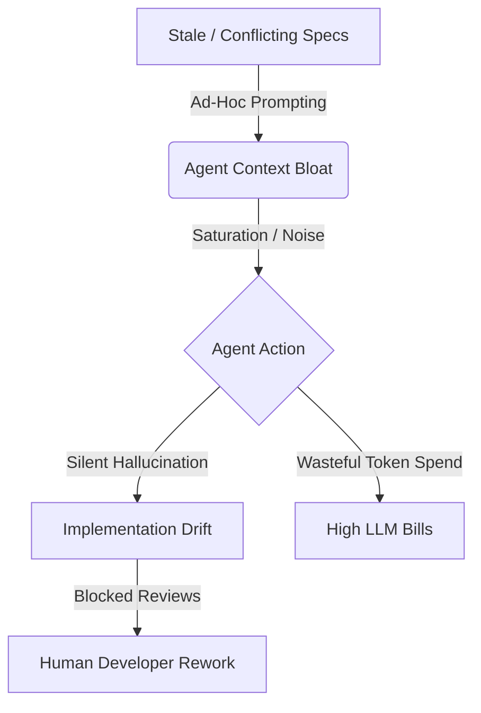

# SpecRegistry Presentation Slidedeck (30-Minute Pitch)

This slidedeck is designed for a **30-minute presentation** to stakeholders, engineering leaders, and developers to explain the purpose, mechanics, and value proposition of SpecRegistry in the age of AI-assisted engineering.

---

## Slide 1: Title Slide
* **Title:** SpecRegistry: The Control Plane for Spec-Driven AI Development
* **Subtitle:** Versioning, Governing, and Observing the Context that Drives Human and AI Code Generation
* **Duration:** 1 minute
* **Visual Concept:** Minimalist, high-end technical design with a dark backdrop. A clean system diagram showing SpecRegistry sitting at the center of humans, AI agents, and repositories.

### Key Bullet Points:
* **The New Reality:** AI agents are writing code, but who is governing their constraints?
* **SpecRegistry:** An SDD (Spec Driven Development) control plane.
* **The Goal:** Turn Markdown specifications (`DESIGN.md`, `API.md`) into versioned, verifiable, and economically optimized context.

### Speaker Notes:
> "Hello everyone. Today, we're talking about a fundamental shift in how we build software. We've entered an era where AI agents and human developers co-author code. But as our generative capabilities scale, a critical gap has emerged: governance. How do we ensure that both human developers and autonomous agents follow the exact same architecture, security, and API rules?
> 
> SpecRegistry is the answer. It is a control plane for Spec Driven Development (SDD) that governs Markdown specifications, distributes them as signed context, and observes whether those specs are useful, followed, and cost-effective. Let's dive into why we built this and how it works."

---

## Slide 2: The Context — Spec Driven Development in the AI Era
* **Title:** Why Spec Driven Development (SDD)?
* **Duration:** 3 minutes
* **Visual Concept:** A comparison table or dual-column layout contrasting "Tribal Knowledge" vs. "Spec Driven Development."

| Aspect | Tribal Knowledge (Status Quo) | Spec Driven Development (SDD) |
| :--- | :--- | :--- |
| **Source of Truth** | Slack threads, stale READMEs, review comments | Governing, versioned Markdown specs in a registry |
| **Agent Context** | Injected ad-hoc, guessing, or massive context dumps | Scoped, signed, and structured specs fetched via MCP |
| **Review Gate** | Discovered *after* code is written, causing rework | Specs approved *before* implementation begins |
| **Observability** | None. Unknown if guidelines are followed or read | Active drift checks, agent feedback, and conformance audits |

### Key Bullet Points:
* **Specs are Code:** Specifications should be treated as versioned source-of-truth contracts.
* **AI Sensitivity:** AI agents do not have "common sense" or corporate memory. They are highly sensitive to the quality, relevance, and currency of their input context.
* **The Shift:** Move from reactive review gates (rejecting code in PRs) to proactive governance (aligning on specs first).

### Speaker Notes:
> "Spec Driven Development is simple in theory: implementation should be governed by explicit, versioned specifications rather than by tribal memory, hidden reviewer preferences, or whatever random context an agent happens to pull.
>
> In an AI-assisted organization, this is no longer optional. When agents receive stale, contradictory, or bloated instructions, they don't stop and ask. They hallucinate plausible-looking but incorrect code, leading to massive implementation drift and hours of human debugging. SpecRegistry treats specifications as first-class, versioned software contracts to prevent this."

---

## Slide 3: The Core Problem — Broken Context & Token Saturation
* **Title:** The Cost of Poor Context
* **Duration:** 3 minutes
* **Visual Concept:** Mermaid flowchart illustrating the broken development loop where agents guess, drift, and burn tokens.



### Key Bullet Points:
* **Spec Drift:** Codebase changes, but local specs are left behind. Agents implement against outdated constraints.
* **Spec Conflict:** Global security rules say 'TLS-only,' but local APIs allow plaintext. The agent is trapped in contradicting instructions.
* **Token Saturation:** Blindly injecting massive docs into prompts degrades model attention and wastes budget.
* **Missing Intent:** Specs describe *mechanics* but not *why* (non-goals, tradeoffs, operational constraints).

### Speaker Notes:
> "Let's talk about the economics and failure modes. Right now, context is managed through ad-hoc prompts or huge copy-pasted files. This leads to three severe issues:
>
> First is Spec Drift. A spec changes in the central repo, but a developer's local branch has an old version.
> Second is Spec Conflict. Different documents give conflicting rules, leaving the agent to guess.
> Third is Token Saturation. If you dump 100,000 tokens of documentation into a prompt, the LLM loses attention, misses critical rules, and runs up massive API bills. 
> 
> SpecRegistry directly solves these issues by treating prompt context as a scarce, measurable budget—what we call Tokenomics—and providing deterministic tools to prevent drift and conflict."

---

## Slide 4: SpecRegistry Overview — The Solution
* **Title:** SpecRegistry: An SDD Control Plane
* **Duration:** 2 minutes
* **Visual Concept:** A high-level schematic showing the three interface layers (Web Dashboard, CLI, MCP Server) communicating with the central registry storage.

### Key Bullet Points:
* **Centralized Registry:** Holds organization-wide (Global) and domain-specific (Project Type) specifications.
* **Semantic Versioning:** Specs move from `0.1.0` drafts to published versions through strict change requests and review gates.
* **Active Verification:** Automatic linting, structural compatibility reports, and deterministic conflict checks.
* **Context Compiler:** Generates agent-optimized files (`CLAUDE.md`, `AGENTS.md`, `.cursorrules`) directly from governed sources.

### Speaker Notes:
> "SpecRegistry is not just a wiki or a documentation site. It is an active control plane.
>
> It centralizes specifications in a hierarchy: Global specs that apply to everyone, Project Type specs for domain categories, and Project-Scoped overrides for individual codebases.
> 
> Every spec is semver-controlled. Changes can't just be edited inline; they must go through a formal Change Request showing a unified diff, lint failures, and a conflict report. When approved, it compiles directly into the files your IDE and agents actually read, securing the registry as the single source of truth."

---

## Slide 5: System Architecture
* **Title:** The Three Pillars of SpecRegistry
* **Duration:** 3 minutes
* **Visual Concept:** A clean architectural diagram mapping out the Web UI, Backend API, Developer CLI, and MCP Server.

```
                    ┌────────────────────────┐
                    │     Web Dashboard      │ <── Human Reviewers
                    │ (Review, Audit, Admin) │
                    └───────────┬────────────┘
                                │
                                ▼
  ┌────────────────────────────────────────────────────────┐
  │                      Backend API                       │
  │     (Fastify + SQLite, Spec Engine, LLM Gateway)       │
  └─────────────────────────────┬──────────────────────────┘
             ▲                  │                  ▲
             │                  │                  │
             ▼                  ▼                  ▼
  ┌─────────────────────┐┌──────────────┐┌──────────────────┐
  │    Developer CLI    ││  MCP Server  ││   Integrations   │
  │ (`specreg` in CI/CD)││(specreg-mcp) ││(Slack, GitHub)  │
  └─────────────────────┘└──────────────┘└──────────────────┘
            ▲                  ▲
            │                  │
            └───────┬──────────┘
                    │
                    ▼
          [AI Agent / Developer]
```

### Key Bullet Points:
* **Web UI (React/Vite):** A high-density dashboard for approving change requests, tracking agent feedback, and configuring policies.
* **CLI (`specreg`):** A Node-based CLI that runs locally and in CI/CD pipelines to initialize workspaces, check for drift, and submit drafts.
* **MCP Server (`specreg-mcp`):** Connects AI agents directly to the registry via standard Model Context Protocol, allowing real-time spec retrieval and feedback.
* **Backend Core (Fastify + SQLite):** A lightweight, self-contained server with support for LDAP/Auth, webhooks, and Prometheus scraping.

### Speaker Notes:
> "Architecturally, the product consists of three pillars:
>
> 1. The Web Dashboard: A developer-focused UI for managing specs, viewing diffs, and triaging AI feedback.
> 2. The CLI: A lightweight command-line tool. It operates in your local terminal and run in CI/CD to block pull requests if code and specs drift.
> 3. The MCP Server: A Model Context Protocol server that sits between the agent and the registry, feeding the agent specifications dynamically.
>
> The backend is written in Fastify with SQLite, meaning you can run it locally in seconds, or deploy it via Docker Compose with zero external DB dependencies."

---

## Slide 6: The Spec Lifecycle & Review Gate
* **Title:** Immutable Versioning and Governance
* **Duration:** 3 minutes
* **Visual Concept:** A timeline visualization showing the progression of a spec:
  `Draft (0.1.0) ──> Review Request (Diff & Lint) ──> Approval (CODEOWNERS) ──> Published (1.0.0)`

### Key Bullet Points:
* **Change Requests:** Published specs cannot be edited directly; they require a Change Request containing proposed content and a diff.
* **Compatibility Reports:** Automatic analysis of heading changes. (e.g., Removed sections trigger a `MAJOR` warning; added sections trigger a `MINOR` notification).
* **Contradiction Reports:** LLM-backed scanning checks the new spec against existing global and project-type specs for conflicts.
* **Approval Policies:** CODEOWNERS-style rules. You can require multiple approvers, specific users, or groups based on path and file globs.

### Speaker Notes:
> "Let's walk through how a specification is updated. SpecRegistry prevents unauthorized edits by requiring a Change Request for any published spec.
> 
> When a change is proposed, the system runs static checks:
> First, a Compatibility Report checks heading changes to suggest if this is a Major, Minor, or Patch change.
> Second, a Contradiction Report checks for conflicting instructions.
> Third, the system evaluates the active Approval Policy. Just like CODEOWNERS in GitHub, you can require that security specs must be approved by the Security Group, or API specs by the Integration Team. Only after approval is the spec promoted, hashed, and signed."

---

## Slide 7: AI Agent Integration & The Feedback Loop
* **Title:** Direct Agent Access & Real-Time Telemetry
* **Duration:** 3 minutes
* **Visual Concept:** A loop diagram showing the agent pulling specs via MCP, discovering an ambiguity, sending telemetry to the dashboard, and a human reviewing/triggering an LLM draft-fix.

```
 ┌──────────────┐      get_specs()      ┌──────────────┐
 │              │ ────────────────────> │              │
 │  AI Agent    │                       │ SpecRegistry │
 │  (Cursor/    │ <──────────────────── │  MCP Server  │
 │  Claude/etc) │   (Dynamic Context)   └──────────────┘
 │              │                              ▲
 │              │   report_spec_feedback()     │
 │              │ ─────────────────────────────┘
 └──────┬───────┘ (Ambiguity/Contradiction Alert)
        │
        ▼
 [Web Dashboard] ──> Human Triages ──> "Draft AI Fix" ──> Opens Review
```

### Key Bullet Points:
* **MCP Tools:** List project types, fetch specs, search specs, and pull audit prompts.
* **Dynamic Search:** FTS5 + Semantic Hybrid search. Agents query specs dynamically during a task to save prompt tokens.
* **Spec Citations:** Every retrieved spec section includes stable anchors and permalinks for precise citation.
* **The Feedback Loop:** Agents call `report_spec_feedback` when they find a contradiction or vague guidance. Complaints cluster on the dashboard for human triage.

### Speaker Notes:
> "The absolute magic of SpecRegistry is the AI Feedback Loop.
> 
> When an agent is working in your repository, it uses the Model Context Protocol to fetch specifications. If it encounters a section that is vague, contradictory, or out of date with the code, the agent doesn't guess. It hits the `report_spec_feedback` tool.
>
> This feedback is sent directly back to the SpecRegistry dashboard, where it is clustered by issue. A human editor can look at a cluster of agent complaints and click 'Draft AI Fix'. The server sends the spec and the feedback to an LLM, generates a draft correction, and opens a change request. The human stays in control, but the friction of maintaining specs is automated."

---

## Slide 8: Developer Workflow & CI/CD Integration
* **Title:** Seamless CLI Integration for Developers and CI/CD
* **Duration:** 3 minutes
* **Visual Concept:** Two-column terminal mockups showing CLI commands and a GitHub Actions workflow snippet.

### Command Catalog:
* `specreg init` — Scaffolds workspace, pulls spec bundle, writes signed manifest.
* `specreg generate` — Scans code and drafts missing specifications based on file trees.
* `specreg check` — Audits local specs against the registry. Fails if local specs have drifted.
* `specreg sync` — Pulls approved specs and compiles `CLAUDE.md`, `AGENTS.md`, and `.cursorrules`.

### CI/CD Drift Gate:
```yaml
- uses: joeldg/SpecRepository/.github/actions/specreg-check@main
  with:
    server: https://specs.example.com
    token: ${{ secrets.SPECREG_TOKEN }}
    fail-on-drift: "true"
```

### Speaker Notes:
> "SpecRegistry fits seamlessly into existing developer workflows.
> 
> When starting a new repository, developers run `specreg init`. This pulls down the approved specifications and scaffolds the project. It also fetches standard Google style guides matching the languages in the repository as advisory files.
>
> In CI/CD, we run `specreg check`. If a developer makes a local edit to a spec file without submitting a Change Request to the registry, the drift gate catches it, posts the diff as a PR comment, and fails the build. This ensures the central registry remains the absolute, uncorrupted source of truth."

---

## Slide 9: Observability & Tokenomics
* **Title:** Context Budget Optimization & Spec Efficacy
* **Duration:** 3 minutes
* **Visual Concept:** Graph mockups showing Spec Efficacy (Success Rate with vs. without Spec) and Token ROI.

### Key Bullet Points:
* **Context Tokenomics:** Prompt tokens are expensive and dilute LLM attention. Specs must earn their prompt budget.
* **Spec Efficacy Testing:** The server runs automated evaluations—testing agent task completion with and without a spec in context.
* **Token ROI Dashboard:** Identifies specs that are frequently loaded but rarely cited or followed, flagging them as noise.
* **Stale Load-Bearing Specs:** Flags specs that have not been updated in months but are still heavily requested by agent runs.

### Speaker Notes:
> "Context is a scarce resource. Dumbing down thousands of lines of code guidelines into an LLM's prompt is a waste of money and ruins reasoning quality. We treat context as a budget.
>
> SpecRegistry includes automated Spec Efficacy Testing. The server runs tasks with and without a specific specification in context, grading the results. If a spec doesn't improve the agent's code output, it has low Efficacy.
> 
> The Token ROI dashboard flags specs that cost money in prompt tokens but provide no actual lift, helping teams refactor their documentation to be concise, highly specific, and outcome-oriented."

---

## Slide 10: Enterprise Security & Integrations
* **Title:** Built for Enterprise Scale and Workspaces
* **Duration:** 2 minutes
* **Visual Concept:** Integrations icon grid showing Slack, GitHub, Prometheus, Grafana, and LDAP.

### Key Features:
* **Two-Way Git Sync:** Subscribed repos can sync specs via pull requests. If a developer edits a spec file in GitHub, an inbound webhook automatically opens a change request in the registry.
* **Slack Interactive Approvals:** Review alerts are sent to Slack. Reviewers can approve or reject spec changes directly from Slack using interactive buttons.
* **LDAP & RBAC Authentication:** Authenticate users against Active Directory/LDAP, mapping security groups to registry roles (`admin`, `reviewer`, `author`, `agent`).
* **Prometheus Observability:** A public `/metrics` endpoint reports spec counts, review SLA age, and feedback spikes to Grafana.

### Speaker Notes:
> "For enterprise deployments, SpecRegistry is fully equipped:
>
> It features two-way Git synchronization: editing a spec file in GitHub opens a review in the registry, and publishing a spec in the registry can auto-open a PR in GitHub.
>
> It integrates with Slack, enabling interactive button approvals for reviews.
> 
> And it supports LDAP group mapping for single sign-on, along with custom API keys for CI/CD agents, all backed by a comprehensive, immutable audit log."

---

## Slide 11: The Business Value & ROI
* **Title:** Why Adopt SpecRegistry?
* **Duration:** 2 minutes
* **Visual Concept:** Highlighted metric boxes showing projected business impact.

```
  ┌────────────────────────┐  ┌────────────────────────┐  ┌────────────────────────┐
  │     -40% Token Cost    │  │    95% Agent Success   │  │    0% Spec Drift       │
  ├────────────────────────┤  ├────────────────────────┤  ├────────────────────────┤
  │ Through section search │  │ Real-time feedback loop│  │ CI/CD drift gates block│
  │ and Hybrid retrieval   │  │ eliminates guesswork   │  │ unapproved overrides   │
  └────────────────────────┘  └────────────────────────┘  └────────────────────────┘
```

### Key Bullet Points:
* **Eliminate Guesswork:** Prevent agents from implementing incorrect assumptions, cutting rework time.
* **Optimize LLM Spend:** Stop sending massive files; retrieve only the precise matching spec sections.
* **Accelerate Onboarding:** Give new hires (and new AI models) a signed, coherent set of guidelines to follow from day one.
* **Continuous Conformance:** Run LLM-backed `specreg audit` to verify if the codebase actually follows the written specs.

### Speaker Notes:
> "Ultimately, SpecRegistry is about engineering speed, quality, and cost control.
>
> By adopting this control plane, we cut down token bills by only sending relevant spec sections via hybrid search. We eliminate the hours developer teams waste when agents implement code based on stale requirements. And we gain continuous compliance checking through automatic code auditing.
>
> It is the missing governance layer for teams building software with AI."

---

## Slide 12: Action Plan & Next Steps
* **Title:** How We Get Started
* **Duration:** 2 minutes
* **Visual Concept:** Three checklist steps representing the initial rollout plan.

### Rollout Steps:
1. **Host the Control Plane:** Deploy SpecRegistry in our internal network (Docker / Node).
2. **Seed Initial Specs:** Load Global Coding Standards and define our first Project Types (e.g., "Web App Standard").
3. **Integrate CLI and MCP:** Hook `specreg` into our pilot repositories, generate initial specs, and configure developer IDEs with the MCP server.
4. **Observe & Refine:** Monitor drift metrics, review agent feedback, and optimize specs based on Efficacy reports.

### Speaker Notes:
> "Getting started is straightforward.
>
> First, we host the control plane internally.
> Second, we seed our existing global guidelines and create a project type for our primary project family.
> Third, we run `specreg init` on our pilot repositories to scaffold their workspace and link the CLI to their CI pipeline.
> 
> From there, we begin observing: we let the agents guide us on where our specs are vague by analyzing their feedback, and we continuously tighten our governance.
>
> I'd love to open the floor to questions and discuss which pilot project we should start with first. Thank you."
