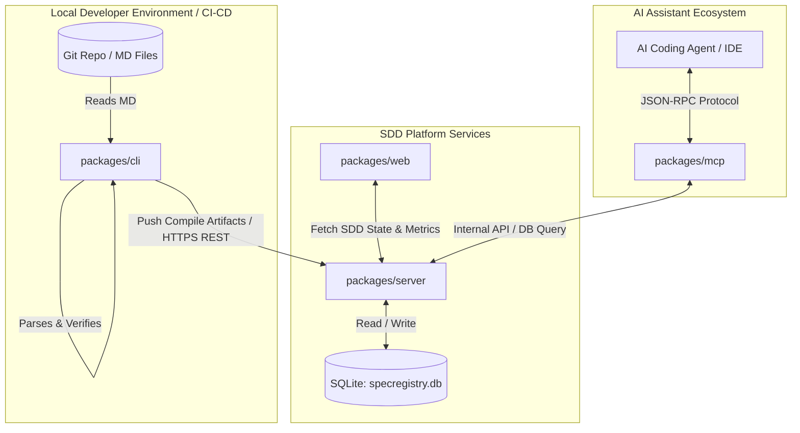
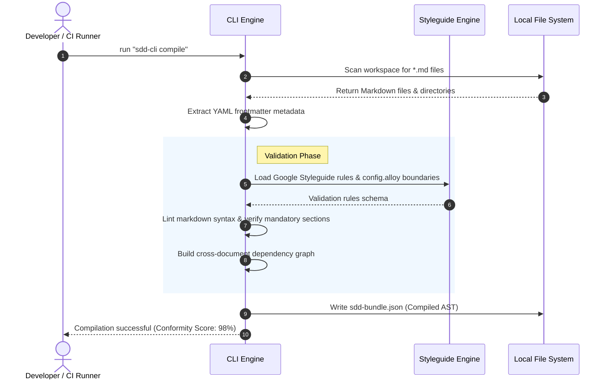
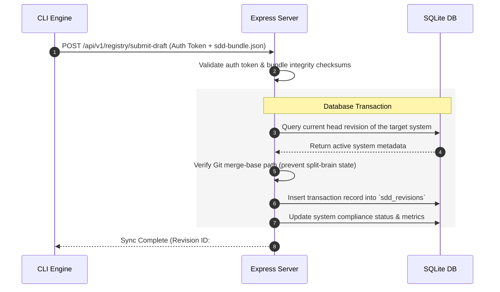
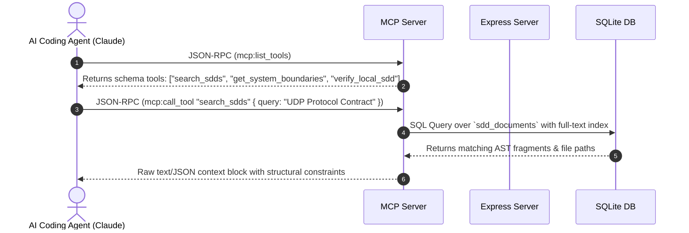
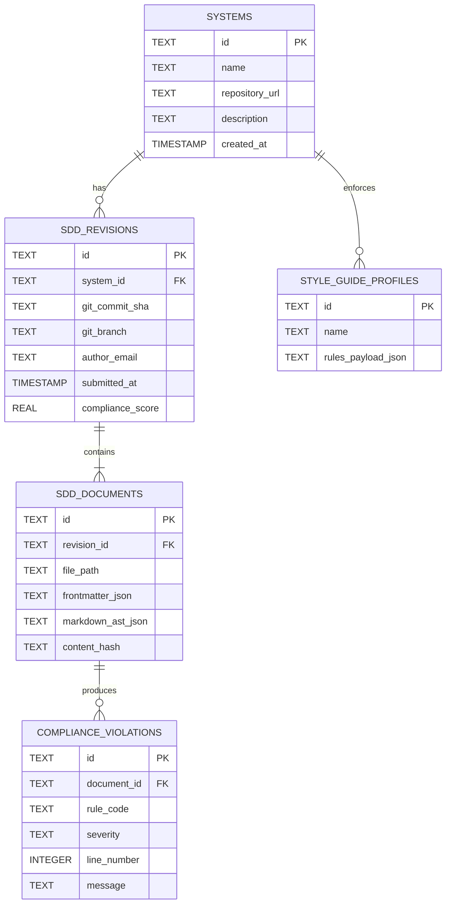

# System Architecture and Design Specification (DESIGN.md)

This document provides a comprehensive technical design specification for the **SDDManager (Software Design Document Manager)**. SDDManager is an enterprise-grade platform built to manage, compile, verify, and query structured Software Design Documents (SDDs). It enables a GitOps-driven workflow where software architecture documentation is treated as code, compiled into structured JSON schemas, audited for style and completeness, and exposed to both human developers and AI coding agents via a Model Context Protocol (MCP) server.

---

## 1. System Architecture Overview

The SDDManager is structured as a monorepo consisting of five decoupled packages that interact over defined protocol boundaries. The system utilizes a centralized SQLite repository, standardizes communication via a `shared` types library, and offers CLI, Web, and MCP interfaces.

### 1.1 High-Level Block Diagram



### 1.2 Component Breakdown

| Package / Directory | Type | Runtime / Tech | Responsibility |
| :--- | :--- | :--- | :--- |
| `packages/cli` | Node CLI Tool | TypeScript, Node.js | Scans directory trees for Markdown files, validates schemas and frontmatter, executes linter/style checks, and compiles documents into single-file AST bundles to sync with the central server. |
| `packages/server` | Back-end API Server | Express, Better-SQLite3 | Exposes REST APIs for document registry, manages historical versions, tracks style-guide conformance scores, handles JWT-based client auth, and serves compiled artifacts. |
| `packages/web` | Front-end SPA | React, Vite, Tailwind | Provides a graphical portal for reading compiled SDDs, tracking audit trails, monitoring team adherence to documentation rules, and visualizing system dependency graphs. |
| `packages/mcp` | Model Context Protocol | TypeScript, MCP SDK | Exposes a standardized Model Context Protocol interface. Enables AI assistants (e.g., Claude, Cursor) to dynamically query, search, and validate software design documents. |
| `packages/shared` | Types & Utilities | TypeScript | Defines system-wide data interfaces, compilation schemas, validation rules, and endpoint specs used by both CLI, Web, and Server. |
| `config/alloy` | Formal Modeling | Alloy Analyzer | Holds formal specification models (`config.alloy`) used to mathematically verify core architectural invariants (e.g., draft submission and revision rules). |

---

## 2. High-Level Design Patterns

To ensure modularity, high performance, and reliability, the SDDManager implements several core design patterns:

### 2.1 Compiler and AST Pattern (packages/cli)
Instead of treating Markdown files as raw text blocks, the CLI compiles them into an Abstract Syntax Tree (AST).
* **Parser:** Reads markdown frontmatter (YAML) and divides headers into hierarchical sections.
* **Semantic Analyzer:** Verifies document cross-references (e.g., an API contract in `API.md` linking to a schema in `DATABASE_SCHEMA.md`).
* **Code Generator:** Produces a single `sdd-bundle.json` containing the AST, schema classifications, and checksums for atomic delivery to the registry.

### 2.2 Contract-First Shared Core Pattern (packages/shared)
To prevent drift across boundaries:
* All network payloads, database entity interfaces, validation errors, and metadata schemas are declared inside `packages/shared`.
* Both `packages/cli` (the producer) and `packages/server` (the consumer) import compile-time contracts from `shared`, enforcing strong end-to-end type safety.

### 2.3 Command/Handler & Registry Sync Pattern
The CLI uses a command pattern organized as explicit actions: `init`, `scan`, `verify`, `compile`, and `sync` (submit drafts).
* Local state changes are buffered in a temporary schema folder.
* Synchronizing with the database utilizes an optimistic concurrency control protocol. The CLI submits the document hash along with parent commit references. If the remote history has diverged, the server rejects the synchronization, requiring a local re-scan and pull.

### 2.4 Model Context Protocol (MCP) Wrapper
To integrate natively with Large Language Models (LLMs), the `packages/mcp` module acts as an adapter layer over the system's registry. It translates context requests from LLMs into direct queries against the SQLite database, using semantic routing to search for design files, retrieve context windows, and output structured tool schema declarations.

---

## 3. Data Flow Patterns

### 3.1 Document Scan, Verification, and Compilation Flow (Local/CI)



### 3.2 Registry Sync and Central Registry Submission Flow



### 3.3 AI Agent Query Protocol Flow (MCP Interface)



---

## 4. Package and Component Deep Dive

### 4.1 CLI (`packages/cli`)
The CLI acts as the entry point for local software engineering loops and automated integration environments.

```
packages/cli/src/
├── index.ts           # Entrypoint, registers commander commands
├── env.ts             # Strongly typed CLI environment parser
├── init.ts            # Bootstraps empty projects with specs/ directories
├── scan.ts            # Recursively navigates disk to build draft manifest
├── verify.ts          # Evaluates markdown AST against Style Guides
├── styleguides.ts     # Engine rules (Google Styleguide standards)
├── compile.ts         # Bundles ASTs, resolves internal file links
├── submitDrafts.ts    # Transports payload to remote Express API
├── registry.ts        # Manages configuration states
└── repo.ts            # Parses git parameters (commit hash, branch, remote)
```

* **Core Logic Flow:**
  When `compile` runs, `scan.ts` filters the local workspaces using exclusion globs. Markdown files are parsed via an AST processing library. `verify.ts` runs checking algorithms on each AST node, evaluating formatting constraints (header ordering, presence of descriptions, valid link definitions). If validation fails, it generates diagnostic issues with row/column locations.

### 4.2 Server (`packages/server`)
The Server is an Express-based engine running SQLite via `better-sqlite3`.

```
packages/server/src/
├── app.ts             # Express initialization, Middleware pipelines
├── db.ts              # SQLite database driver client and schema setup
├── env.ts             # Server configuration validation (yup/zod pattern)
├── index.ts           # HTTP execution server wrapper
├── seed.ts            # Default styles database seeder
├── routes/            # REST API endpoints (systems, docs, sync, telemetry)
└── lib/               # Authentication, token validation, parsing utils
```

* **State Persistence Strategy:**
  SQLite handles concurrently read/write access using Write-Ahead Logging (WAL) mode. Transactions are executed synchronously inside memory-mapped Express route handlers.

### 4.3 Web Client (`packages/web`)
A single-page application focused on dashboard telemetry, audit-trail compliance, and real-time visualization of codebase specifications.

```
packages/web/src/
├── main.tsx           # React virtual DOM mounter
├── App.tsx            # Main layout & router orchestration
├── api.ts             # HTTP client implementation to communicate with server
├── components.tsx     # Reusable UI widgets (cards, diff-views, metric dials)
└── styles.css         # Tailwind utility styling
```

* **Key Views:**
  1. **Compliance Dashboard:** Real-time progress bar of a company's systems, listing which directories are out of sync with their physical code implementation.
  2. **Interdependency View:** A directed visual graph illustrating where system specifications share interface references, enabling impact assessment when system definitions undergo structural modification.

### 4.4 Model Context Protocol Adapter (`packages/mcp`)
A standards-compliant bridge serving programmatic integration to AI systems.

```
packages/mcp/src/
└── index.ts           # Implements MCP Node SDK, tool registrations
```

* **Integration Strategy:**
  By parsing standard commands, the MCP server allows AI-supported editors to retrieve raw file contexts directly from the central design specification database instead of reading massive code paths.

---

## 5. Database Schema Design

The SQLite database (`specregistry.db`) keeps track of systems, draft submissions, structural documents, and validation logs.



---

## 6. Style Guide and Verification Logic

The platform's verification engine (`styleguides.ts` and `verify.ts`) processes markdown files against predefined rule specifications.

### 6.1 Standard Google Documentation Alignment
The platform evaluates incoming document nodes against standard documentation criteria:
* **Section Completeness:** Mandatory sections such as `# System Overview`, `# API Contracts`, and `# Data Structures` are verified using AST node traversal.
* **Structural Correctness:** Evaluates relative header levels (e.g., ensuring a `###` header is preceded by an `##` parent).
* **Reference Isolation:** Inspects external local markdown file pointers to ensure links are valid system-relative paths and do not point to missing assets.

### 6.2 Compliance Score Calculation
The server calculates a cumulative quality score ($Q$) for every uploaded revision:

$$Q = 100 - \left( \frac{10 \cdot E_{critical} + 3 \cdot E_{warning} + 1 \cdot E_{info}}{\text{Total Document Count}} \right)$$

* A system revision with a score of $Q < 80$ is labeled **NON-COMPLIANT** in the Web Dashboard and fails target pull request status checks during CI-CD workflows.

---

## 7. Operational Resilience, Security, and Observability

### 7.1 Security & Authentication Bounds
* **CLI Sync Pipeline:** Communication from CLI to Server requires a cryptographically signed HMAC authorization header. API Tokens are provisioned per system scope on the Admin console and passed to CLI environments via `SDD_API_TOKEN`.
* **Database Isolation:** Better-SQLite3 operations execute in pre-compiled parametrized statement queries to prevent arbitrary runtime SQL injection vector injections.

### 7.2 Observability and Logs
* The REST server implements standardized, colorized stdout formats:
  `[TIMESTAMP] [INFO/WARN/ERROR] [REQUEST_ID] METHOD /path STATUS_CODE - duration_ms`
* Revisions maintain transition telemetry logs, ensuring tracking of documentation updates alongside Git branch merges.

### 7.3 Performance Optimizations
* **Bundle Caching:** The CLI caches local file hash maps under `.sdd_cache/` to identify unmodified files, running markdown parsing passes only on modified documents.
* **Database Indexing:** SQLite tables contain index overlays on foreign keys (`revision_id`, `system_id`) to maintain fast payload query evaluation, even with extensive history tracking.