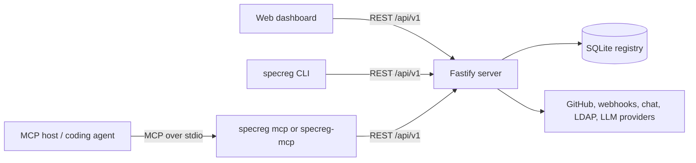
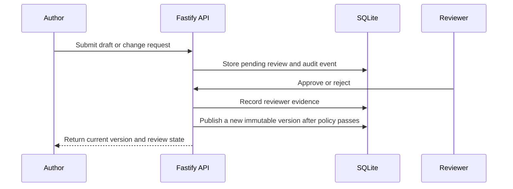

# SpecRegistry System Architecture and Design

## Scope

This specification governs the architecture of SpecRegistry itself. SpecRegistry is a
TypeScript monorepo that manages versioned Markdown specifications, distributes governed
context to developers and agents, records review and compliance evidence, and exposes that
state through a web application, CLI, REST API, and Model Context Protocol (MCP) server.

## Architectural Outcomes

The system must preserve these outcomes:

1. Published specifications remain the reviewed source of truth.
2. Project-specific guidance is isolated from reusable project-type and global guidance.
3. Every distributed bundle is attributable to exact spec versions and content hashes.
4. Review, approval, publication, feedback, compliance, and administrative actions remain
   auditable.
5. Agent integrations use bounded registry APIs instead of direct database access.
6. Deployments can require authentication without embedding credentials in generated files
   that are intended for source control.

## Runtime Architecture

### Package Responsibilities

| Package | Responsibility |
| --- | --- |
| `packages/server` | Fastify REST API, SQLite persistence and migrations, authentication and RBAC, review workflow, audit evidence, integrations, metrics, and production static-web serving. |
| `packages/web` | React/Vite management dashboard using the server REST API. |
| `packages/cli` | `specreg` developer workflow: initialization, sync, verification, compilation, traceability, compliance, audits, and embedded MCP serving. |
| `packages/mcp` | Legacy standalone MCP stdio server that translates MCP tool calls into registry REST requests. |
| `packages/shared` | Shared TypeScript domain types and deterministic helpers used across packages. |

The packages communicate through explicit interfaces. The web client, CLI, and MCP servers
must not open or mutate the registry SQLite database directly.

## Server Design

The server is built with Fastify. `packages/server/src/app.ts` constructs the application,
registers cross-origin policy and request authentication, and mounts route families under
`/api/v1`. `packages/server/src/index.ts` owns process startup, secure-posture checks,
backup scheduling, and listening on the configured port.

SQLite is accessed through `better-sqlite3`. Schema creation and append-only migrations live
in `packages/server/src/db.ts`. The server uses WAL mode and parameterized statements.
Routes may compose deterministic helpers, but durable state changes must continue to honor
review, audit-log, and scope semantics.

Important durable entities include:

- `project_types`: reusable baselines plus the global scope.
- `repo_consumers`: concrete repositories attached to a project type.
- `specs` and `spec_versions`: current specifications and immutable published history.
- `change_requests` and `review_approvals`: proposed changes and approval evidence.
- `agent_feedback`, `audit_reports`, `audit_log`, and compliance/trace tables: governance
  evidence.
- `users` and `tokens`: identities and hashed bearer-token records.
- governed skill identities, versions, assignments, sources, and candidates.

Database migrations must be additive. Existing review, approval, audit, feedback, and
traceability records must not be rewritten merely to simplify a feature.

## Specification Lifecycle

An update to a published specification must go through a change request. Required reviewer
counts, separation of duties, stable/beta channel behavior, and audit attribution are
enforced by the server. Initial project-scoped specifications may be published only through
the explicit workflow supported for enrolled agents and authorized actors.

## Distribution and Integrity

The server distributes governed specs as downloads, compiled context, agent packs, search
results, and MCP responses. Downloads include `specs/.specregistry.json` containing exact
versions and SHA-256 content hashes. The signed manifest payload uses Ed25519; local
`specreg verify` checks both file hashes and the signature against the originating
registry's public key.

Generated MCP and agent guidance must use the effective public registry URL. Resolution
follows `SPECREG_PUBLIC_URL`, forwarded host/protocol headers, and finally the local bind
address. Auth-required deployments use bearer tokens supplied with `--token` or
`SPECREG_TOKEN`.

## CLI Design

`packages/cli/src/index.ts` parses commands and delegates to focused modules. Major command
families include:

- Repository onboarding and currency: `init`, `check`, `sync`, and `migrate`.
- Context and draft workflows: `generate`, `compile`, and `submit-drafts`.
- Traceability and governance: `code-map`, `trace-check`, `comply`, `audit`, and
  `audit-report`.
- Agent integration: `mcp`.
- Governed skills and advisory style-guide management.

The CLI reads and writes local repository artifacts but communicates with registry state
through REST. It must use `SPECREG_TOKEN` or `--token` for authenticated registries and must
not invent a separate authentication convention.

## MCP Design

Generated configurations prefer `specreg mcp`; `packages/mcp` remains the standalone legacy
binary. Both implementations are MCP stdio adapters over the registry REST API.

Core tools include governed context loading and search (`begin_task`, `get_specs`,
`search_specs`, and `resolve_guidance`), feedback reporting, governed skill discovery, token
usage reporting, and compliance/session evidence. MCP implementations must send
`SPECREG_TOKEN` as a bearer token when configured and use `SPECREG_REPO` to request the
correct project-scoped context.

MCP tools must not query SQLite directly. The REST API remains the authorization,
observability, and scope boundary.

## Web Design

The web package is a React application built by Vite. It obtains all registry state through
`packages/web/src/api.ts`. Page components cover specs, reviews, feedback, reports,
projects, baselines, skills, templates, and settings.

The dashboard is an administrative presentation layer, not a second business-logic
implementation. Server responses remain authoritative for authorization, lifecycle rules,
and persisted evidence.

## Authentication and Authorization

Requests authenticate with bearer tokens or `x-api-key`; stored token material is hashed.
The server supports local users and optional LDAP authentication with the roles `agent`,
`author`, `reviewer`, and `admin`. Route policies in `packages/server/src/lib/auth.ts` define
minimum roles, while project-scoped agent requests receive additional repository-scope
checks in their handlers. An enrolled agent identity is bound to a single repository: it
may only create, edit, or publish project-scoped specs for that repository, and it may only
read project-scoped specs, skills, and search results for that repository. Requests for
global or project-type specs (no specific project scope) remain readable to any agent, since
those are shared governance documents. Human and dev-mode (anonymous) callers are unaffected
and retain cross-repository read access.

When `SPECREG_AUTH=required`:

- Non-public routes require a valid, unexpired token.
- The server must refuse insecure default-admin posture at startup.
- Administrative settings, user/key management, audit evidence, and operational controls
  require the admin role.
- Generated and documented clients use `SPECREG_TOKEN`; credentials are not committed.
- `specreg init` must obtain an enrolled agent token before setting up an agent workspace,
  and must fail closed (rather than continue unauthenticated) when the registry enforces
  auth. The public `GET /api/v1/health` response reports `auth_required` so clients can
  detect the registry's posture without a token.

Secrets stored in settings may be encrypted at rest with `SPECREG_SECRET_KEY`. Public
configuration responses expose presence/status metadata rather than secret values.

## Observability and Operations

`GET /metrics` exposes Prometheus metrics. The registry also records audit-log entries,
context delivery, real LLM token usage when available, feedback, compliance attestations,
trace reports, and deterministic audit reports.

Backups use SQLite's online backup API, checksum sidecars, retention, and optional scheduled
execution. Public URL configuration, server version checks, LLM providers, application
keys, LDAP, feature flags, and backup controls are managed through admin-only routes.

## Architecture Invariants

- Fastify is the only HTTP server framework for the registry API.
- SQLite access is owned by `packages/server`.
- MCP, CLI, and web clients use registry APIs rather than direct database access.
- Shared types must remain free of runtime dependencies on the other internal packages.
- Authentication uses registry bearer/API tokens, not JWT or custom HMAC request signing.
- Published spec changes preserve immutable version history and review evidence.
- Generated context remains aware of public URL and token configuration.
- Operational and governance evidence must be classified from explicit event semantics,
  not incidental words in human-readable summaries.

## AI Agent Directives

Before changing a package boundary, route contract, authentication behavior, database
schema, review workflow, bundle format, or MCP tool, compare the change with this
specification and the product specification in `docs/SPEC.md`. Report contradictions or
outdated guidance instead of implementing around them. Update architecture documentation
in the same reviewed change whenever a public interface or durable invariant changes.
