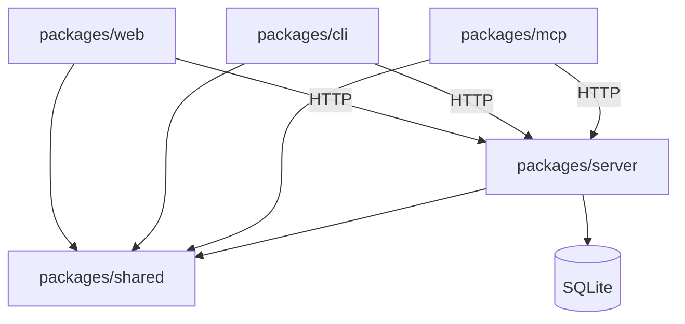

# SpecRegistry Codebase Structure

## Scope

This specification maps the repository's package boundaries, entry points, configuration,
tests, sidecars, and dependency direction. It is descriptive where paths are expected to
exist and normative where ownership boundaries prevent architectural drift.

## Repository Layout

```text
SpecRegistry/
├── packages/
│   ├── cli/                 # specreg command-line application and embedded MCP server
│   ├── mcp/                 # legacy standalone MCP stdio server
│   ├── server/              # Fastify API, SQLite data model, integrations, and operations
│   ├── shared/              # shared TypeScript types and pure helpers
│   └── web/                 # React/Vite dashboard
├── docs/                    # user, developer, API, operations, and product documentation
├── specs/                   # governed specifications for this repository
├── samples/ai-sdd/          # sample specification pack and loader
├── config/alloy/            # formal model and Alloy checks
├── .github/                 # CI workflow and bundled SpecRegistry check action
├── Dockerfile               # production container build
├── docker-compose.yml       # local/container deployment composition
├── package.json             # npm workspace scripts
└── tsconfig.base.json       # shared TypeScript compiler options
```

Generated build output, local databases, credentials, MCP configuration, and local
traceability artifacts are not source modules. Their ignore/tracking policy must remain
explicit so governed specs are not confused with transient agent output.

### Sidecar and Metadata Artifacts

| Artifact | Format | Purpose |
| --- | --- | --- |
| `.spec/code-map.json` | Schema V2 dictionary JSON | Compact AST/code-entity inventory with deduplicated strings and tuples. |
| `.spec/code-trace.json` | Schema V2 dictionary JSON | Compact graph linking code entities to governed specs, coverage, and drift metrics. |
| `.spec/code-map.sqlite` | SQLite | Local zero-token index for CLI lookups and compliance checks. |
| `.spec/trace-overrides.json` | JSON | Explicit reviewed link overrides and waivers for traceability. |

Sidecars are local or generated evidence, not registry persistence. Their schemas and
tracking policy are governed by `OBSERVABILITY_AND_TRACEABILITY.md`.

## Package Entry Points

| Package | Runtime entry | Supporting entry points |
| --- | --- | --- |
| CLI | `packages/cli/src/index.ts` | Command modules under `packages/cli/src`; published binary name `specreg`. |
| MCP | `packages/mcp/src/index.ts` | Published legacy binary `specreg-mcp`; generated configs prefer `specreg mcp`. |
| Server | `packages/server/src/index.ts` | `app.ts` builds Fastify; `db.ts` owns schema/migrations; `seed-cli.ts` and `backup-cli.ts` provide operational commands. |
| Web | `packages/web/src/main.tsx` | `App.tsx` owns routing/layout; `api.ts` owns REST calls; page modules live under `src/pages`. |
| Shared | `packages/shared/src/index.ts` | Shared types and helpers exported for workspace consumers. |

Each workspace has its own `package.json` and `tsconfig.json`. Root scripts orchestrate
workspace builds and tests.

## Server Structure

```text
packages/server/src/
├── app.ts                   # Fastify construction and route registration
├── index.ts                 # environment startup, posture checks, scheduler, listen
├── db.ts                    # SQLite schema and append-only migrations
├── env.ts                   # environment-file loading and configuration
├── seed.ts                  # idempotent baseline/demo data
├── seed-cli.ts              # seed command entry
├── backup-cli.ts            # backup/verify/restore command entry
├── routes/                  # HTTP handlers grouped by domain
└── lib/                     # reusable domain, integration, security, and report helpers
```

Route modules currently cover project types, projects, specifications, reviews, feedback,
automation, skills, administrative/reporting APIs, authentication, integrations, and
metrics. New routes belong in the closest domain module and must be registered in
`app.ts`.

Database schema changes belong only in `db.ts` and must be append-only. Cross-route logic
that represents a durable rule belongs in `lib/` rather than being copied between
handlers.

## CLI Structure

`packages/cli/src/index.ts` owns argument parsing and command dispatch. Focused modules own
individual workflows, including initialization, synchronization, compilation, verification,
draft submission, code mapping, compliance, audits, migrations, skills, style guides, and
MCP serving.

CLI modules may:

- Read repository files and Git metadata.
- Write generated local artifacts in documented locations.
- Call registry REST endpoints through the shared CLI request helper.

CLI modules must not import server internals or open the registry database.

Tests live under `packages/cli/test` and use Node's test runner.

## MCP Structure

`packages/mcp/src/index.ts` is a standalone stdio MCP adapter. The CLI has an embedded MCP
implementation in `packages/cli/src/mcp.ts`. Both call the registry over HTTP and use the
same public environment conventions:

- `SPECREG_SERVER` for the registry URL.
- `SPECREG_TOKEN` for bearer authentication.
- `SPECREG_REPO` for concrete project context.

Neither MCP implementation owns registry persistence.

## Web Structure

```text
packages/web/src/
├── main.tsx                 # React bootstrap
├── App.tsx                  # application shell and routes
├── api.ts                   # typed REST client
├── components.tsx           # shared dashboard components
├── styles.css               # application styles
└── pages/                   # domain pages and report/settings views
```

Business rules and authorization remain server-owned. Web code should render server state,
collect user intent, and call typed API helpers rather than duplicating lifecycle decisions.

## Dependency Direction



`packages/shared` is the internal leaf dependency and must not import the server, CLI, MCP,
or web packages. Runtime clients may depend on shared contracts, but only the server owns
SQLite and privileged integration configuration.

The web, CLI, and MCP packages must remain independently buildable after `packages/shared`
has been built.

## Tests and Verification

| Area | Location / command |
| --- | --- |
| Full TypeScript and web build | `npm run build` |
| Full workspace tests | `npm test` |
| Server tests | `packages/server/test`, run through the server workspace |
| CLI tests | `packages/cli/test`, run through the CLI workspace |
| CI | `.github/workflows/ci.yml` |
| Governed bundle currency/integrity | `specreg check` and `specreg verify` |

Server behavior changes require tests. Public API, deployment, authentication, CLI/MCP,
or workflow changes require corresponding documentation updates.

## Configuration Boundaries

Runtime configuration is supplied through environment variables and settings persisted by
the server. Important deployment variables include:

- `PORT` and `SPECREG_DB`.
- `SPECREG_PUBLIC_URL`.
- `SPECREG_AUTH`, `SPECREG_ADMIN_PASSWORD`, and `SPECREG_TOKEN`.
- `SPECREG_SECRET_KEY`.
- Backup, LDAP, LLM, integration, and feature-specific variables documented in
  `docs/OPERATIONS.md`.

Do not repurpose generated client configuration as server configuration. `.mcp.json`,
`.spec/`, and local credentials belong to consuming-repository workflows.

## Ownership Rules

- `packages/server/src/db.ts` owns schema migration.
- `packages/server/src/lib/auth.ts` owns global role policy.
- Route handlers own domain validation and project-scoped authorization.
- `packages/web/src/api.ts` owns dashboard endpoint wiring.
- `packages/cli/src/registry.ts` owns CLI registry HTTP/auth behavior.
- `packages/cli/src/mcp.ts` and `packages/mcp/src/index.ts` must remain behaviorally aligned
  for shared MCP capabilities.
- `docs/` explains product and operator workflows; `specs/` states governed requirements.

## AI Agent Directives

Place changes in the package that owns the behavior and preserve the dependency direction
above. Before adding a new helper or route, search the owning package for an existing
implementation. Do not move database access into clients, duplicate authorization in the
dashboard, or create undocumented authentication variables. When repository structure
changes, update this specification in the same reviewed change.
