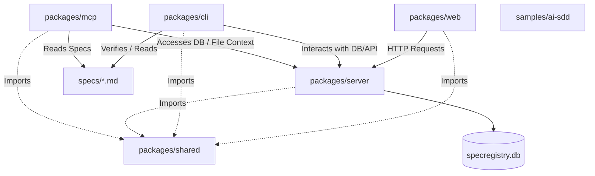

# Codebase Structure and Architecture Map

This document outlines the directory structure, entry points, configuration frameworks, and module dependencies of the SDDManager (System Design Document Manager) monorepo.

---

## 1. Core Directory Purposes

The repository is organized as a monorepo containing distinct execution layers, static specification templates, and local configuration environments.

```
SDDManager/
├── config/             # High-level configuration models (e.g., Alloy verification specs)
├── docs/               # Tokenomics, design decisions, and system specifications
├── packages/           # Monorepo workspaces (TypeScript codebase)
│   ├── cli/            # CLI engine for document auditing, compilation, and registry sync
│   ├── mcp/            # Model Context Protocol (MCP) server for LLM integration
│   ├── server/         # Express backend API and database management engine
│   ├── shared/         # Common schemas, TypeScript interfaces, and shared utilities
│   └── web/            # Vite + React frontend single-page application (SPA)
├── samples/            # Standardized sample documents for seeding and testing
│   └── ai-sdd/         # Pre-configured mock system designs and standards files
└── specs/              # Root specifications defining engineering policies and protocols
```

### Workspace Directory Profiles

| Directory | Type | Purpose |
| :--- | :--- | :--- |
| `packages/cli` | TypeScript CLI | Executable tool for developers and agents to initialize, lint, compile, and sync specs locally or in CI/CD pipelines. |
| `packages/mcp` | TypeScript Server | Model Context Protocol engine enabling LLMs and AI Agents to securely read, search, and navigate System Design Documents. |
| `packages/server` | Express Server | Core API layer managing specs, verification runs, styleguides, and persistence to SQLite (`specregistry.db`). |
| `packages/shared` | Library | Zero-dependency baseline schemas, types, validations, and helper utilities shared across the monorepo workspace. |
| `packages/web` | React SPA | Visual interface for browsing registered systems, monitoring sync histories, analyzing metrics, and viewing style violations. |

---

## 2. Entry Points & Configurations

### Runtime Entry Points

The platform consists of multiple runtime processes with the following primary execution entries:

| Service / Tool | Entry File Path | Execution Purpose |
| :--- | :--- | :--- |
| **Monorepo (Root)** | `package.json` | Controls monorepo workspace dependencies via NPM workspaces. |
| **CLI Workspace** | `packages/cli/src/index.ts` | Dispatches CLI subcommands (e.g., `init`, `compile`, `verify`, `sync`). |
| **MCP Workspace** | `packages/mcp/src/index.ts` | Boots up the Model Context Protocol engine over stdio/HTTP interfaces. |
| **Server Workspace** | `packages/server/src/index.ts` | Starts the Express server listening on the configured HTTP port. |
| **Server Database Seeder** | `packages/server/src/seed-cli.ts` | Populates SQLite tables from initial spec directories and samples. |
| **Web Workspace** | `packages/web/src/main.tsx` | Hydrates the React DOM application; binds to `packages/web/index.html`. |

### Configuration Mapping

Each package is configured and constrained by its corresponding config workspace profiles:

```
SDDManager/
├── package.json                   # Root workspace composition and global actions
├── tsconfig.base.json             # Shared compiler options inherited across modules
├── docker-compose.yml             # Local multi-container development orchestrator
├── Dockerfile                     # Multi-stage production container build manifest
├── specregistry.db                # Active SQLite database (development/local runtimes)
├── config/
│   └── alloy/
│       └── config.alloy           # formal modeling assertions and system validations
└── packages/
    ├── cli/
    │   ├── package.json           # CLI runtime dependencies & bin mappings
    │   └── tsconfig.json          # TS target settings optimized for Node.js executable
    ├── mcp/
    │   ├── package.json           # MCP dependencies (e.g., `@modelcontextprotocol/sdk`)
    │   └── tsconfig.json          # TS target optimized for modern ESM Node runs
    ├── server/
    │   ├── package.json           # Backend dependency mappings
    │   └── tsconfig.json          # TS config customized for SQLite & Express modules
    ├── shared/
    │   ├── package.json           # Core shared types & schemas dependencies
    │   └── tsconfig.json          # TS target optimized for ultra-compatible ESM/CJS build formats
    └── web/
        ├── package.json           # Frontend framework and bundling dependencies
        ├── tsconfig.json          # TS configuration compiled for DOM targets
        └── vite.config.ts         # Vite bundler options, proxy configurations, and build assets
```

---

## 3. Dependency Mapping Between Modules

The internal monorepo modules utilize a strict hierarchical dependency model to ensure decoupling, prevent circular references, and isolate system boundaries.

### Architectural Dependency Graph



### Workspace Relationships

1. **`packages/shared` (The Leaf Node)**:
   * **Inbound Dependencies**: `packages/web`, `packages/cli`, `packages/mcp`, and `packages/server`.
   * **Outbound Dependencies**: None. Must remain free of other internal workspaces to prevent cyclic compile runs.
   * **Responsibility**: Contains models, types, schema contracts (e.g., Markdown parse types, database entity schemas, validation schemas).

2. **`packages/server` (The Business Logic Hub)**:
   * **Inbound Dependencies**: Called by `packages/web` (HTTP endpoints) and interacted with by `packages/cli` (Sync Actions).
   * **Outbound Dependencies**: `packages/shared`. Directly manipulates and exposes the state maintained in `specregistry.db`.

3. **`packages/cli` (The Verification Agent)**:
   * **Inbound Dependencies**: Executed directly by CI platforms or local developers.
   * **Outbound Dependencies**: `packages/shared`. Parses specifications (`specs/*.md`) and pushes verification states to `packages/server`.

4. **`packages/mcp` (The LLM Interface)**:
   * **Inbound Dependencies**: Invoked by standard MCP host clients (e.g., Claude Desktop, cursor, dev-agents).
   * **Outbound Dependencies**: `packages/shared`. Reads SQLite state and provides context maps to connected LLM agents.

5. **`packages/web` (The Presentation Layer)**:
   * **Inbound Dependencies**: Served directly to browsers.
   * **Outbound Dependencies**: `packages/shared` (for matching types), and connects over API interfaces to `packages/server` to query operational status.